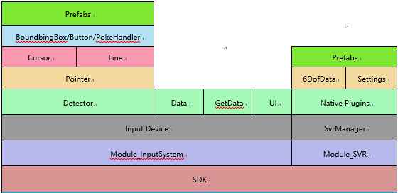

# Architecture overview

要想全面了解SDK，本较介绍的如下内容将帮助到你：

- SDK设计思想
- SDK组成

本文不会涉及具体细节，只会向读者描绘SDK的全貌概述

## SDK设计思想

基于SDK平台衍生的生态环境的健壮及扩展性考虑，SDK的设计思想总结一句话即 **“一切皆Module”**

`Module`是一个独立的功能集合，也可称为组件`Component`，`Module`可以依赖其他`Module`。

* **API** - Module提供的API
* **Prefab** - Module提供的预制体

### 参考

* [查看SDK当前已有的Module][查看SDK当前已有的Module]

## SDK组成

SDK当前包含的Module中核心两个Module分别位Module_InputSystem和Module_SVR

* **Module_InputSystem** - 输入系统模块，负责管理所有的输入设备（头显/手柄/手势/游戏控制器）
* **Module_SVR** - 与系统底层交互的模块，负责Slam数据的获取

SDK的概略图如下：

### 参考

* [Module_InputSystem的详细介绍][Module_InputSystem的详细介绍]

* [Module_SVR的详细介绍][Module_SVR的详细介绍]

