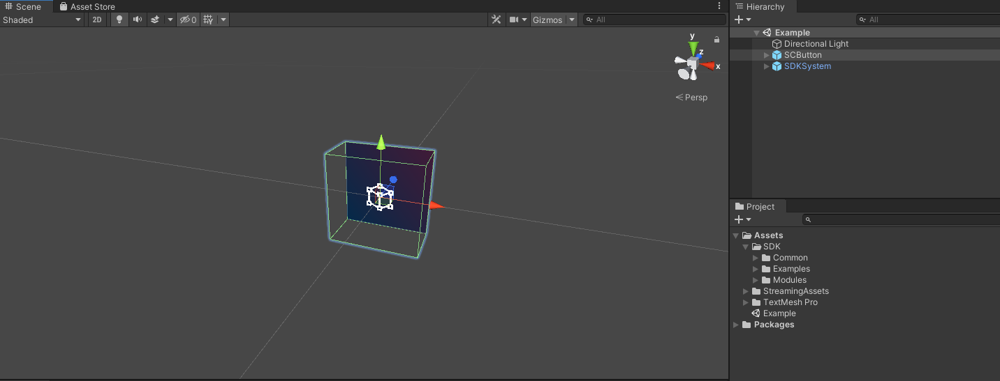
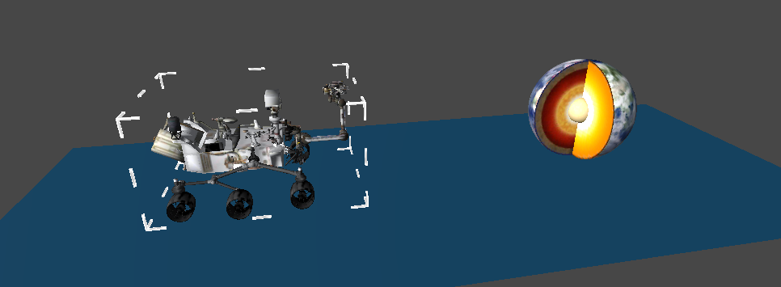

# **Getting started tutorials**


## Overview

欢迎来到入门教程！

在这里你将学习到SDK提供的功能，如果有XR设备，你将可以体验自己设计的项目运行在设备上的真实效果，这将加速你的项目开发速度.

入门教程将完成如下内容：

1. 准备工作
3. 使用**头显方式**，**游戏控制器方式**，**自由手势方式**与虚拟对象交互
3. 更广泛的交互操作


## 准备工作
开始入门教程前，请先阅读如下文档完成准备工作：

* [Getting started with SDK](../Getting started with SDK.md)

> Getting started with SDK 介绍 SDK的下载及基本使用流程


  

## 使用**头显方式**，**游戏控制器方式**，**自由手势方式**与虚拟对象交互

本节中你将学习如下内容：

* 添加可交互虚拟对象

* 启用或关闭InputDevice

* 开启头显方式

* 开启游戏控制器和蓝牙手柄方式

* 开启自由手势方式

  


### 添加可交互虚拟对象

为演示SDK提供的不同交互方式，先要创建一个可以交互的3D虚拟对象，本节使用SDK自带的SCButton作为交互对象.

欲在Scene中添加SCButton，点击菜单项 **GameObject > SDK > SCButton** 即可




### 启用或关闭InputDevice

可以动态的开启或者关闭某些InputDevice，按如下图，找到SDK配置文件 SDKConfiguration.asset文件，配置SDK的一些属性


* **ActiveHead**的值为"1"：开启InputDeviceHead输入设备（头显方式）

* **ActiveGGT26Dof**的值为"1"：开启InputDeviceGGT26Dof输入设备（自由手势方式）

  > InputDeviceGGT26Dof 输入设备开启会自动关闭InputDeviceHead输入设备

* **ActiveBT3Dof** 的值为"1"：开启InputDeviceBT3Dof输入设备（蓝牙手柄方式）

  > InputDeviceBT3Dof 输入设备开启会自动关闭InputDeviceHead输入设备

* **ActiveKS** 的值为"1"：开启InputDeviceKS输入设备（游戏控制器方式）

  > InputDeviceKS 输入设备开启会自动关闭InputDeviceHead输入设备

* **KSMode6Dof**的值为"1"：开启InputDeviceKS输入设备的6Dof模式


> 备注：属性值设置SDK的默认状态，应用运行过程中会生成配置文件，目录为/sdcard/Android/data/packagename/files/SDK_Configs.txt，覆写其中的值可以达到在不重新编译APP的情况下修改SDK的配置


### 开启头显方式

头显方式是指：使用**XR设备上的按键**及**XR设备自身的位姿**变化来操作虚拟的3D对象

开启头显的方式是在SDKConfiguration配置中设置**ActiveHead**的值为1 

此时点击Play按钮运行，通过鼠标键盘的控制模拟XR设备中的行为：

* **移动视角**： 长按 **<kbd>W/A/S/D</kbd>** 按键 **前/后/左/右** 
* **旋转视角**：长按 **<kbd>鼠标右键</kbd>** 并 **移动鼠标** 

将光标移动到SCButton上，点击<kbd>**鼠标左键**</kbd>触发点击，至此即完成了通过头显方式与SCButton的交互


### 开启游戏控制器和蓝牙手柄方式

游戏控制器方式是指：使用**XR设备提供的游戏控制器**（3Dof/6Dof）及**XR设备自身的位姿**变化来操作虚拟的3D对象

开启游戏控制器的方式是在SDKConfiguration配置中设置**ActiveBT3Dof** 的值为"1"（开启K02 / K07系列蓝牙手柄），设置**ActiveKS** 的值为1（开启K11/ K101/ K102系列游戏控制器）

> K02/ K07系列只支持3Dof，K11/ K101/ K102支持3Dof/6Dof
>
> 游戏控制器方式和头显方式如果同时打开，则头显方式会自动Disable

同理，将光标移动到SCButton上，点击<kbd>**鼠标左键**</kbd>触发点击，至此即完成了通过手柄方式与SCButton的交互。


### 开启自由手势方式

自由手势方式是指：使用**XR设备内置的自由手势**及**XR设备自身的位姿**变化来操作虚拟的3D对象

开启自由手势的方式是在SDKConfiguration配置中设置**ActiveGGT26Dof**的值为"1"

> 自由手势方式和头显方式如果同时打开，则头显方式会自动Disable

同理，将光标移动到SCButton上，点击<kbd>**鼠标左键**</kbd>触发点击，至此即完成了通过自由手势方式与SCButton的交互。


## 更广泛的交互操作

本节将列举SDK支持的交互操作，具体如下：

* 通用事件交互
* 拖拽交互
* 手势点击交互
* 一些交互组件


### 通用事件交互
通用事件交互即指Unity EventSystm事件系统所支持的事件交互，SDK全面支持Unity EventSystem事件系统，使用方法如下：

* 实现接口
* 使用EventTrigger组件
* 继承PointerHandler

#### 实现接口

直接实现Unity提供的接口即可监听事件，常用的事件接口如下：

	IPointerExitHandler //焦点移除触发事件
	IPointerEnterHandler //焦点进入触发事件
	IPointerDownHandler //按下触发事件
	IPointerClickHandler //按下并松开触发事件
	IPointerUpHandler //松开触发事件
	IDragHandler //拖拽触发事件
> 需引用命名空间：UnityEngine.EventSystems
> 更详细的使用请参照[Unity官方EventSystems文档](https://docs.unity3d.com/Packages/com.unity.ugui@1.0/manual/EventSystem.html)


#### 使用EventTrigger组件

使用Unity EventSystem提供的EventTrigger事件监听组件
> 详细使用见[Unity官方EventTrigger文档](https://docs.unity3d.com/Packages/com.unity.ugui@1.0/manual/script-EventTrigger.html) 


#### 继承PointerHandler

为方便开发者使用，SDK中提供了封装好的PointerHandler类供开发者使用，其实质类似于EventTrigger组件，将常用的事件接口实现，如下图：

``` Cshape
public interface IPointerHandler : 
    IPointerExitHandler, 
    IPointerEnterHandler, 
    IPointerDownHandler,
    IPointerClickHandler,
    IPointerUpHandler, 
    IDragHandler{
}
```
``` Cshape
public class PointerHandler : MonoBehaviour, IPointerHandler {
...
}
```

> SDK提供的SCButton上的PressableButton即通过继承PointerHander而来


### 拖拽交互

拖拽交互是指通过长按拖动达到移动虚拟对象的目的，SDK中拖拽对象操作非常简单，直接在拖拽的虚拟对象上添加ManipulationHandler，设置部分属性即可。

如下演示拖拽交互的使用：

添加**虚拟游戏对象**

将如下目录EarthCore游戏对象拖拽到Scene视图中：

`Assets/SDK/Examples/StandardAssets/Prefabs/EarthCore.prefab`

**设置Transform属性**

* **Position**： x=0.2f ,y =0, z = 0.5f
* **Rotation**： x = 0, y = 0, z = 0
* **Scale**： x=10, y= 10, z=10

**添加BoxCollider**

Hierarchy窗口展开EarthCore，在其子物体node_id30上添加BoxCollider组件，调整BoxCollider属性如下：

* **Center**：x=0, y=0.1, z=0

* **Size**： x=0.2f, y=0.2f, z=0.2f

**添加ManipulationHandler组件**

在EarthCore子物体node_id30上添加ManipulationHandler组件，并设置属性：

**Target**：赋值为EarthCore游戏对象


点击运行按钮，将光标移动到EarthCore上，点击拖拽<kbd>**鼠标左键**</kbd>，即可实现拖拽EarthCore

> 拖拽交互可以使用头显、游戏控制器、自由手势方式


### 手势点击交互

手势点击交互是指通过手指触碰虚拟对象，触发点击功能的交互，SDK中对于手势点击交互，提供了如下组件：

* **PokeHandler**

  PokeHandler用于监听手指如下触碰事件：

  * **PokeDown**：手指进入虚拟对象Collider，调用一次
  * **PokeUp**：手指离开虚拟对象Collider，调用一次
  * **PokeUpdated**：手指保持在虚拟对象Collider，每帧调用

* **TouchableButton**

  基于PokeHandler实现的按键点击组件

如下演示手势点击交互的使用：

**添加虚拟游戏对象**

将如下目录TouchableObject游戏对象拖拽到Scene视图中：

`Assets/SDK/Examples/StandardAssets/Prefabs/TouchableObject.prefab`

**设置Transform属性**

* **Position**：x=-0.2f ,y =0, z = 0.5f
* **Rotation**： x = 0, y = 0, z = 0
* **Scale**： x=1, y= 1, z=1

**添加HandInteractionTouchRotate组件**

HandInteractionTouchRotate组件继承于PokeHandler，在TouchableObject子物体FrontPlate上添加HandInteractionTouchRotate组件，并设置属性：

* **TargetObjectTransform**： 赋值为TouchableObject子物体Platonic (1)

**设置NearInteractionTouchable属性**

NearInteractionTouchable组件表示游戏对象具有Touchable的能力，添加PokeHandler组件会自动添加此组件，确保NearInteractionTouchable组件的如下属性：

* **Events To Receive**： Touch


开启手势交互模式，点击运行按钮，通过鼠标键盘的控制模拟XR设备中的行为：

* **移动视角**：长按 **<kbd>W/A/S/D</kbd>** 按键 **前/后/左/右** 

将**手势食指**移入，移出，保持在到TouchableObject上，即可查看效果。


**添加TouchableButton**

点击菜单项 **GameObject > SDK > SCButton**，添加SCButton，确保如下属性：

**设置Transform属性**

* **Position**： x=-0.1f, y =0, z = 0.45f
* **Rotation**： x = 0, y = 0, z = 0
* **Scale**： x=1, y= 1, z=1

**SCButton对象上挂载TouchableButton组件**

TouchableButton组件表示SCButton是可以被近处手势Touch的Button

> 添加TouchableButton组件会自动添加NearInteractionTouch组件，
>
> NearInteractionTouch组件表示具有被手势近处Touch的能力


开启手势交互模式，点击运行按钮，通过鼠标键盘的控制模拟XR设备中的行为：

* **移动视角**：长按 **<kbd>W/A/S/D</kbd>** 按键 **前/后/左/右** 

用**手势食指**点击SCButton，即可查看效果。


### 一些交互组件

SDK中提供了一些交互组件，方便开发者进行交互操作：

* BoundingBox

BoundingBox可以通过头显，蓝牙手柄，自由手势，游戏控制器对虚拟对象进行动态编辑的组件，修改虚拟对象的Poistion，Rotate，Scale等属性，具体请见[BoundingBox](../Modules/Module_Interaction/BoundingBox.md)介绍



* ManipulationHandler

ManipulationHandler可以通过双手或单手对物体进行移动，缩放，旋转，具体请见[ManipulationHandler](../Modules/Module_Interaction/ManipulationHandler.md)介绍


## Congratulations

你已经初步了解了SDK的交互操作，更加全面的交互体验，可以尝试打包SDK.Example.unitypackage中附带的Example例程，如：

`Assets/SDK/Examples/HandTracking/Scenes/00_InteractionExample.unity`

此例程中你将看到SDK提供的所有支持的交互操作。


