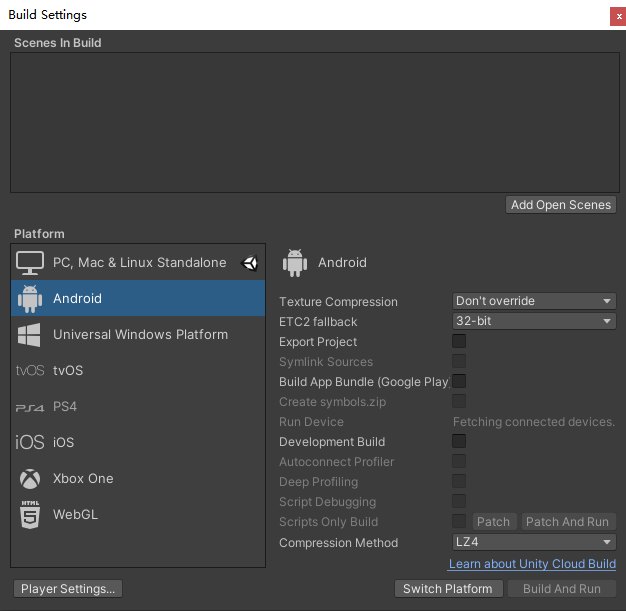
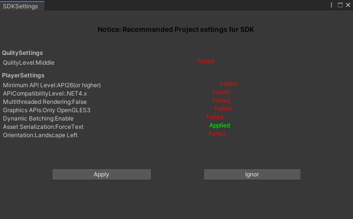
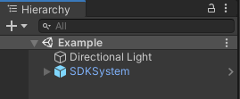
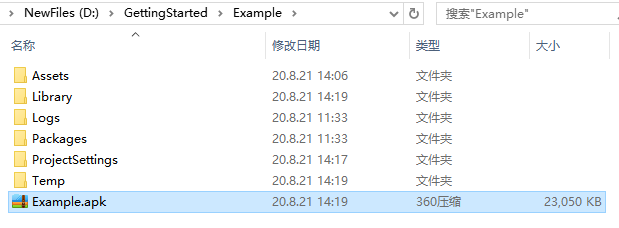
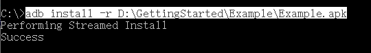
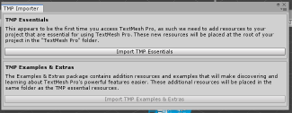

# **Getting started with SDK**

**SDK** 全称 **Software Development Kit**，意为开发工具集

本SDK提供开发虚拟/混合现实应用所需的相关文档、范例、工具、API的集合，使用SDK可以开发运行于相关XR设备的应用，其提供完整的相关XR设备开发环境和最优化的设备访问方式，使开发者快速高效的完成应用开发。
> 
> XR设备：我司发布的MR、VR设备 ，后文统一引述为XR设备

本教程将按顺序完成如下内容：

1. 准备工作
2. 完成第一个SDK项目
3. 参考阅读

## 准备工作
开始使用SDK前，需要如下软件或设备：
* [Visual Studio 2019](https://visualstudio.microsoft.com/downloads/)
* [Unity Hub](https://docs.unity3d.com/Manual/GettingStartedInstallingHub.html) with Unity  installed and the Android Platform Build Support module added
> 注意：推荐版本Unity 2019.2.3f1以上（2019.3.X除外），不推荐使用2019.3.X（存在内存泄漏问题）
* AndroidSDK (API26及以上)
* XR设备

## 完成第一个SDK项目

本节中你将学习如下内容：

* 新建Unity Project，下载并导入SDK，设置ProjectSettings
* 使用SDK打包第一个项目安装到XR设备

### 步骤：

1. **获取最新版SDK UnityPackages**
2. **新建Unity Project**
3. **切换到Android平台**
4. **导入TextMeshPro 相关package**
5. **导入SDK**
6. **设置ProjectSettings**
7. **新建Unity Scene并添加SDKSystem**
8. **打包Android Application**
9. **安装Apk到XR设备**

#### 获取最新版SDK UnityPackages

1. Go to the [SDK release page](https://webapps.shadowcreator.com/developer/#/sdk/sdkDownload)
2. 下载unitypackage:
   * **SDK.Foundation.unitypackage**
   * **(_Optional_)**SDK.Examples.unitypackage
> 或者从GitHub获取 [实时更新版本](https://github.com/ShadowCreatorSDK/SDK4/releases/) 

> unitypackage contents 包含的内容，参见[SDK PackageContents](../SDK unitypackages.md)

#### 新建Unity Project

打开UnityHub，选择项目标签，点击新建右侧倒三角符号，选择使用推荐的Unity版本新建项目

> 如果推荐的Unity版本未安装，请从Unity官网下载并安装

在新建项目的窗口确保如下几项，然后点击创建即可：

* 模板选择 **3D**
* **位置** 及 **项目名称** 中不能出现中文字符

#### 切换到Android平台

新建项目后，下一步选择正确的平台，编译**Android Application**，将平台切换至**Android Platform**:

1. 打开菜单项 **File >Build Settings**

2. 在Platform列表中，选择 **Android** 平台

3. 点击 **Switch Platform**  

   > 如果未有SwithcPlatform按钮，请查看Unity是否未安装Android Platform Build Support module 

#### 导入TextMeshPro 相关package

由于SDK中一些Prefabs和assets需要 **TextMesh Pro**，所以需要导入相关插件包

点击菜单项 **Window > TextMeshPro > Import TMP Essential Resources**打开导入窗口：

在导入窗口中，点击 **All** 按钮以确保所有资源都选中，然后点击 **Import** 按钮导入资源：

#### 导入SDK

点击菜单，**Assets > Import Package > Custom Package**  ，选择下载的**SDK.Foundation.unitypackage**，在打开的Import Unity Package 窗口点击 **All** 按钮以确保所有资源都选中，然后点击 **Import** 按钮导入资源.

按同样步骤导入 **SDK.Examples.unitypackage**

> **SDK.Examples.unitypackage** 演示SDK的模块使用

#### 设置ProjectSettings

导入**SDK.Foundation.unitypackage**后，SDK会通过弹出如下界面让开发者进行一些设置:

其中`Failed`表示未设置为推荐值，`Applied`表示已设置为推荐值。可以通过点击`Apply`按钮将所有设置修改为推荐值。如果想使用自己的设置，可以点击`Ignore`按钮。强烈建议使用推荐设置，未使用推荐设置可能导致无法运行，显示异常等问题。

> 如未弹出界面，可以点击菜单项 **SDK > ProjectSettings** 查看
>
> **(强烈建议点击Apply完成所有推荐设置)**

>点击Apply后，仍有Failed项，如果不能自行解决，请联系我们

#### 新建Unity Scene并添加SDKSystem

* 点击菜单项  **File > New Scene**  创建一个新Scene，点击菜单项File > Save 命名并保存Scene，此例中命名为Example。
* 删除Scene中的Main Camera
* 点击菜单项  **SDK > SDKSystem** ，将SDKSystem添加到当前Scene中，如图所示：

**SDKSystem**游戏对象包含如下:  

>**SvrCamera** - 完成与系统Slam交互，提供6Dof数据等  
>**InputSystem** - 管理输入系统，提供交互事件等

#### 打包Android Application

点击菜单项 File > Build Settings打开Build Settings 窗口，点击Add Open Scenes按钮添加当前Scene，然后点击Build 按钮，设置Application 保存路径，开始编译:

等待编译完成，Unity将弹出保存路径，可以看到编译出的Apk文件：

#### 安装Apk到XR设备

保证XR设备开机并电量充足，将数据线连接电脑与XR设备，通过如下adb命令安装Apk即可：

> adb 的详细使用方法请自行查阅

可以点击app图标进入应用，查看最终效果

## Congratulations

你已经成功打包并安装了第一个运行于XR设备的Application，由于Scene中并无内容，所以打开应用将不能看到更多内容，为此，你可以尝试打包**SDK.Example.unitypackage**中附带的Example例程，如打包：

`Assets/SDK/Examples/HandTracking/Scenes/00_InteractionExample.unity`

此例程中你将看到SDK提供的交互操作。

## 参考阅读

#### Getting started tutorials

如果你时第一次接触SDK或者XR开发，推荐先完成Getting Started tutorials的学习

* [Getting started tutorials](../Getting started tutorials.md)

#### SDK更多内容

想要了解SDK提供的更多内容，请阅读如下文档：

* [SDK 目录结构](../Modules/SDK Unitypackage.md)
* [SDK 架构设计](../Architecture/overview.md)
* [SDK 模块介绍](../Architecture/overview.md)
* [SDK API使用](../API)
* [SDK ReleaseNotes](../SDK ReleaseNotes.md)

#### Run the 00_InteractionExample scene in the Unity Editor

 00_InteractionExample 是SDK中一个比较全面介绍手势交互的Example 

按如下步骤操作：
1. 确保导入了 **SDK.Example.unitypackage**，并从如下路径打开InteractionExample：
    `Assets/SDK/Examples/HandTracking/Scenes/00_InteractionExample.unity`

2. 可能会有如下提示框提示Import "TMP Essentials" 
      

    点击"Import TMP Essentials" Button,"TMP Essentials"是指Text Mesh Pro plugin,某些Prefabs或者assets使用了Text Mesh Pro

3. 点击Play按钮即可查看效果

#### Editor模式下使用键盘模拟XR设备中的行为

如何在Scene中**移动或旋转视角**
* **移动视角**：长按 **<kbd>W/A/S/D</kbd>** 按键 **前/后/左/右** 
* **旋转视角**：长按 **<kbd>鼠标右键</kbd>** 并 **移动鼠标** 

如何在Scene中模拟 **手势输入**：
* 模拟 **双手手势抓取**：点击 **<kbd>鼠标左键</kbd>**
* 模拟 **左/右手势抓取**：点击键盘键 **<kbd>1/2</kbd>** 
* 模拟 **左/右手势丢失**：长按键盘键 **<kbd>O/P</kbd> **

