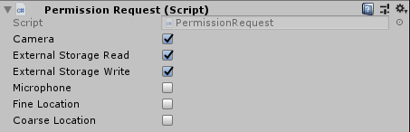
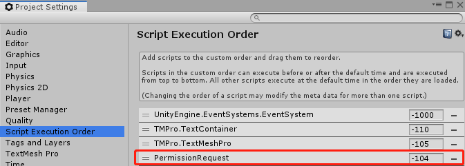

# Module_AndroidPermission

**Module_AndroidPermission**模块在于android6.0(API 23)后的系统版本通过动态获取权限。

本节将完成如下内容：

* Android Permission可获取的权限
* Android Permission的使用
* Android Permission使用注意

### Android Permission可获取的权限
  此模块支持获取如下六种权限:
* "android.permission.WRITE_EXTERNAL_STORAGE"
  
>获取Android端的SD卡写入权限

* "android.permission.READ_EXTERNAL_STORAGE"  
  
>获取Android端的SD卡读取权限

* "android.permission.ACCESS_COARSE_LOCATION"  
  
>获取Android端的范围位置信息权限

* "android.permission.ACCESS_FINE_LOCATION"  
  
>获取Android端的精确位置信息权限

* "android.permission.RECORD_AUDIO" 
  
>获取Android端的麦克风权限

* "android.permission.CAMERA"
  
>获取Android端的相机权限

### Android Permission的使用

本节介绍AndroidPermission的使用

* 挂载PermissionRequest组件，并勾选需要的权限

> 组件位于 `SDK\Modules\Module_AndroidPermission\Scripts`路径下,开发者可参照此脚本扩展新的请求权限

* 在眼镜端中项目启动时,会自动弹出权限申请提示框,根据需求允许权限即可。

### Android Permission使用注意

为确保权限申请在使用权限之前进行,在 `Edit>ProjectSettings>Scripts Execution Order`处将`..\Module_AndroidPermission\Scripts \Permission Request.cs`脚本的执行顺序放置在较高的优先级。

