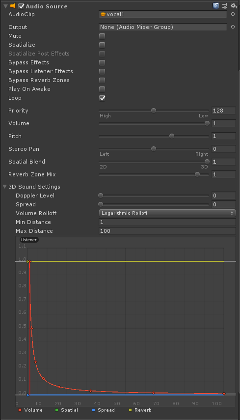
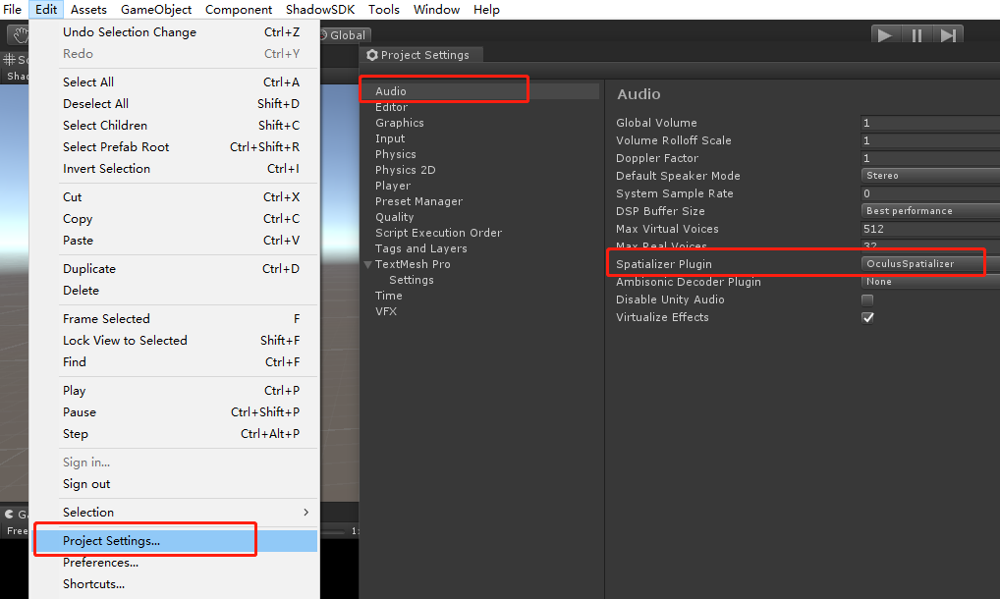
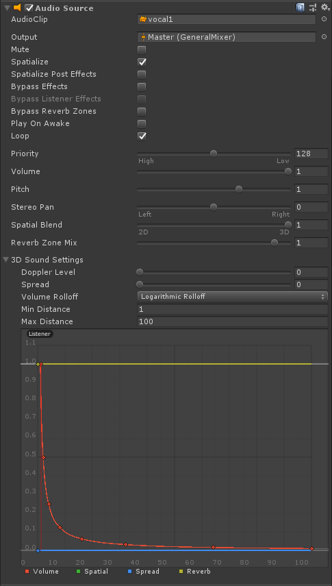
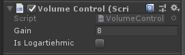

# Module_AudioSpatialize
**AudioSpatialize**模块在于为开发者提供3D空间音效的功能。

## Module_AudioSpatialize的使用

SDK支持两种空间音效的使用方法。第一种是使用`Unity`的`Audio Source`中自带的3D空间声音通道；第二种是使用`Unity`内置的空间音效插件。
后者在体验效果上更佳，但是会花费更多的性能；前者在体验效果上较弱一些，但是不会产生额外的性能消耗。

1、未使用插件的空间音效的使用说明
* 在需要播放音频的游戏对象处添加`Audio Source`组件。
*  在`Audio Source`的`Audio Clip`处设置所需播放的音频。
* `Spatial Blend`的值设为1。
* `Doppler Level`的值设为0。（若需要开启多普勒效应将值设为1）
* `Volume Rollof`的模式设为`Logarithmic Rollof`。

2、空间音效插件的使用说明
* 首先在菜单栏`Window>Package Manager`处导入`Oculus Desktop`空间音效插件。
* 其次在`Edit>Project Settings>Audio>Spatialize Plugin`处选择`Oculus Spatialize`配置。
* 在需要播放音频的游戏对象处添加`Audio Source`组件。
* 在`Audio Source`的`Audio Clip`处设置所需播放的音频。
* 此音频通过一个`Audio Mixer`输出，在`Out put`处选择一个`Audio Mixer`。
* 启用`Spatialize`空间音效化。
* `Spatial Blend`的值设为1。
* `Doppler Level`的值设为0。（若需要开启多普勒效应将值设为1）
* `Volume Rollof`的模式设为`Logarithmic Rollof`。

**注意：**当开启`Spatialize`空间音效后，音频音量会有所降低，此时需要对音频的音量添加一个增益音量。在`Audio Mixer`的`Master>Attenuation>Volume`处将此Volume设为8.0dB的增益。

## 平方反比衰减函数

SDK还为开发者提供了平方反比衰减曲线的空间音效的控制脚本，位于`SDK>Modules>Module_AudioSpatial>Scripts>VolumeControl.cs`处，将此脚本挂载到需要播放音频的游戏对象处即可。

此组件的参数如下：
* **Gain**：开启`Spatialize`空间音效时的音量增益值。
* **Is Logartiehmic**：是否启用对数衰减曲线进行衰减。

**注意：**此增益值需音响混合器（Audio Mixer）暴露`Master>Attenution>Volume`属性给脚本，参数名为“gain”。

  