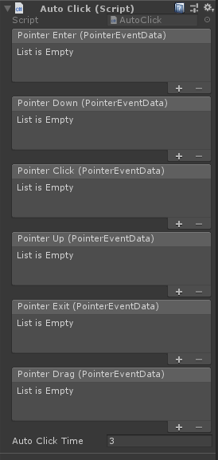

# Module_AutoClick
**AutoClick**模块用在于为开发者提供凝视点击触发事件的功能。

## Module_AutoClick的使用

* SDK为开发者提供了 `AutoClick` 脚本,位于`SDK\Modules\Module_AutoClick\Scripts\AutoClick.cs`处。
* 在需要被凝视点击所触发响应的游戏对象上挂载AutoClick脚本。
* 游戏对象需具备Collider组件（如BoxCollider），拥有被检测的条件。  

## AutoClick脚本的参数解析

此组件的参数如下：
* **PointerEnter**：凝视的Cursor进入Collider的范围时触发响应。
* **PointerDown**：凝视的Cursor进入Collider的范围时达到`AutoClickTime`时间触发按下的响应。
* **PointerClick**：凝视的Cursor在Collider的范围时触发了按下及抬起两种的响应。
* **PointerUp**：凝视的Cursor在Collider的范围时触发了抬起的响应。
* **PointerExit**：凝视的Cursor离开Collider的范围时触发响应。
* **PointerDrag**：凝视的Cursor在Collider的范围时触发拖拽的响应。
* **AutoClickTime**：凝视的Cursor在Collider的范围中停留多长时间触发点击响应。

**扩展:**开发者可参考此脚本扩展凝视点击的响应事件及效果。