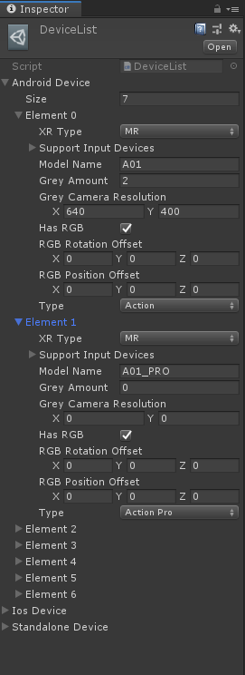

# Module_Device
**Module_Device**模块在于为开发者提供获取各设备基本信息的功能。

## Module_Device的使用

此模块为开发者提供了一些API接口，供开发者使用，如下列部分API：
* **Current**：获取当前的设备平台。
* **CurrentAndroid**：获取当前的Android设备。
* **IsOurGlass**：判断当前设备是否为XR设备。
* **IsPhoneDevice**：判断当前设备是否为手持移动端。

通过上列API获取设备，再通过访问设备下的属性获取设备的基本信息。

## Module_Device的DeviceList参数解析

DeviceList中设备类型分为Android设备、Ios设备及其它设备三种类型。

此配置中参数如下：
* **XR Type**：设备为XR中的哪一类。
* **Support Input Devices**：此设备支持哪几种输入方式。
* **Model Name**：此设备的名称。
* **Grey Amount**：此设备具有几个灰度相机。
* **Grey Camera Resolution**：此设备的灰度相机的分辨率。
* **Has RGB**：此设备是否有RGB相机。
* **RGB Rotation Offset**：此设备的RGB相机的旋转偏离量。
* **RGB Position Offset**：此设备的RGB相机的位置偏离量。
* **Type**：此设备的类型名称。

>**Ios Device**中现未收录设备信息。
>**Standalone Device**中现未收录设备信息。

**扩展:**开发者可参考此模块扩展设备的其它相关信息。