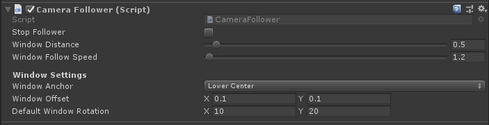

# Module_Follower
**Module_Follower**模块在于为开发者提供使游戏对象可跟随相机视野移动功能。

## Module_Follower的使用

* SDK为开发者提供了 `Camera Follower` 脚本,位于`SDK\Modules\Module_Follower\CameraFollower.cs`处，在需要跟随相机视野功能的游戏对象上挂载CameraFollower脚本即可。  

## Camera Follower的参数解析

此组件的参数如下：
* **StopFollower**：禁用游戏对象的跟随功能。
* **Window Distance**：游戏对象跟随后与Camera保持的距离,默认为0.5米。   
* **Window Follow Speed**：游戏对象跟随的速度，单位为米。
* **Window Anchor**：游戏对象跟随结束后的锚点对其位置。
* **Window offset**：游戏对象的锚点最终位置相对于对其位置的偏移值。
* **Default Window Rotation**：游戏对象的停留位置的朝向。

**扩展:**开发者可参考此脚本扩展游戏对象的跟随效果,恢复至相机视野的相对位置等。