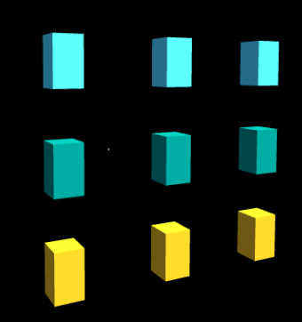
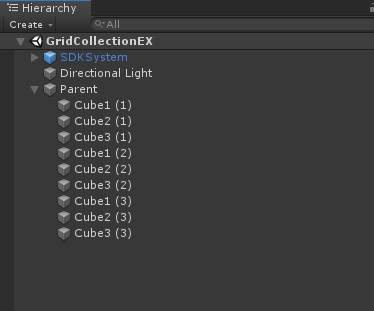
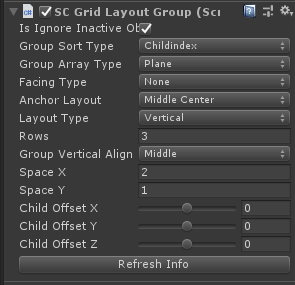

# Module_GridCollection
`Module_GridCollection`模块在于为开发者提供在Editor模式下为任意数量的3D物体进行排列布局的功能。

## Module_GridCollection的使用

* SDK为开发者提供了`SCGrid Layout Group`脚本，位于`SDK\Modules\ Module_GridCollection\Scripts\SCGrid Layout Group`处。

* 为需进行排列布局的任意数量的3D物体创建一个共同的父物体，在此父物体上挂载`SCGrid Layout Group`脚本。

* 在完成参数调整后，点击`Refresh Info`按钮进行3D物体组的排列布局更新。

## SCGridLayoutGroup的参数解析

此组件的参数如下：
* **Is Ignore Inactive Obj**：是否忽略失活的3D物体。
* **Group Sort Type**：3D物体组的排序顺序。
	> **Childindex**: 按渲染的顺序排序
	> **ChildAlphabet**：按3D物体的字母顺序排序
	> **ChildIndexReverse**：按渲染的顺序反向排序
	> **ChildAlphabetReverse**：按3D物体的字母顺序反向排序
* **Group Array Type**：3D物体组以什么队形进行排列。
	> Plane: 平面排列
	> Cylinder：圆柱体状排列
	> Sphere：球状排列
	> Radial：辐射状排列
	> Round：环形排列
* **Facing Type**：各3D物体的正面朝向方向。
	* None: 无朝向
	* FaceOrigin：朝向原点
	* FaceOriginReversed：背向原点
	* FaceParentFoward：朝向父物体的前方位置
	* FaceParentBack：朝向父物体的后方位置
	* FaceParentUp：朝向父物体的上方位置
	* FaceParentDown：朝向父物体的下方位置
	* FaceCenterAxis：朝向中心轴
	* FaceCenterAxisReversed：背向中心轴
* **Anchor Layout**：3D物体组的锚点相对父物体的位置。
* **Layout Type**：3D物体组的布局类型。
	* Vertical：竖直排序
	* Horizontal：水平排序
* **Columns**：排列的列数。
* **Rows**：排列的行数。
* **GroupHorizontalAlign**：3D物体在不满一行时的子物体对齐方式。
* **GroupVerticalAlign**：3D物体在不满一列时的子物体对齐方式。
* **SpaceX**：3D物体间的横向间距。
* **SpaceY**：3D物体间的纵向间距。
* **ChildOffsetX**：3D物体的X轴相对于父物体的值。
* **ChildOffsetY**：3D物体的Y轴相对于父物体的值。
* **ChildOffsetZ**：3D物体的Z轴相对于父物体的值。
* **Radius**：特殊队形的排列半径。
* **RadialRange**：辐射角度。
* **IsAnchorWithAxis**：锚点是否用轴对齐。
* **Refresh Info**：进行数据更新。