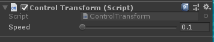

# Module_InputControl
**InputControl**模块用于在PC端调试时提供可以控制视角的前后左右移动及旋转的功能,以模拟眼镜设备走动的情形。

## InputControl的使用

* SDK为开发者提供了`Control Transform`脚本,位于`SDK\Modules\Module_InputControl\Scripts`路径下,开发者可参照此脚本修改其它控制按键。
* 使用方法为将此脚本挂在需要控制的游戏对象上即可。

## Control Transform脚本的参数解析

此组件的功能键如下：
* 参数`Speed`表示游戏对象前后左右移动及旋转的速度,默认为0.1米/秒。
* 按键`W`使对象向前移动
* 按键`S`使对象向后移动
* 按键`A`使对象向左移动
* 按键`D`使对象向右移动
* 鼠标右键长按水平滑动使对象左右旋转
* 鼠标右键长按前后滑动使对象上下旋转

**备注：**此模块脚本已默认挂在SDKSystem/SvrCamera/Head游戏对象上。

