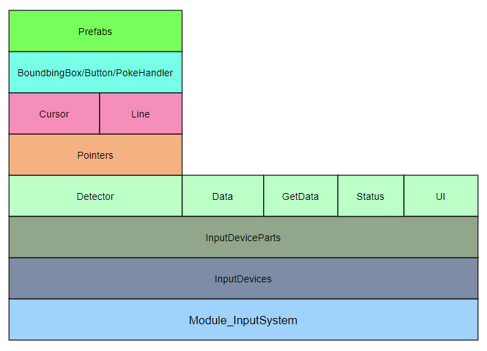
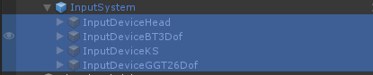
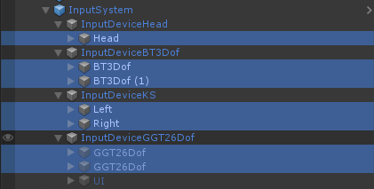
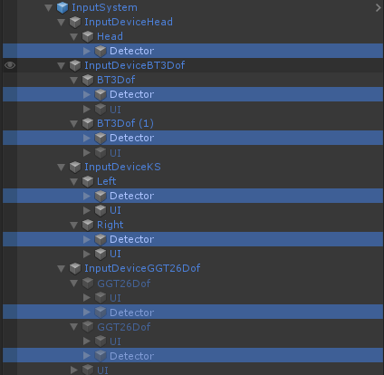
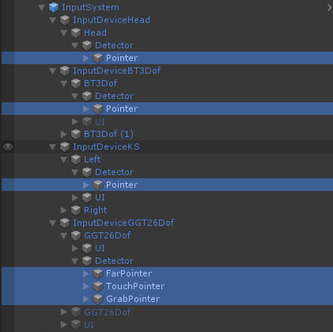
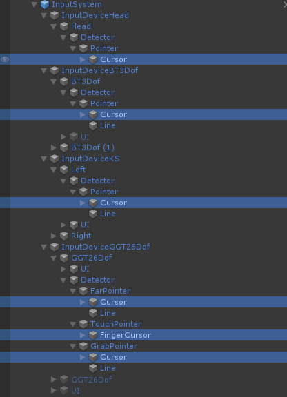
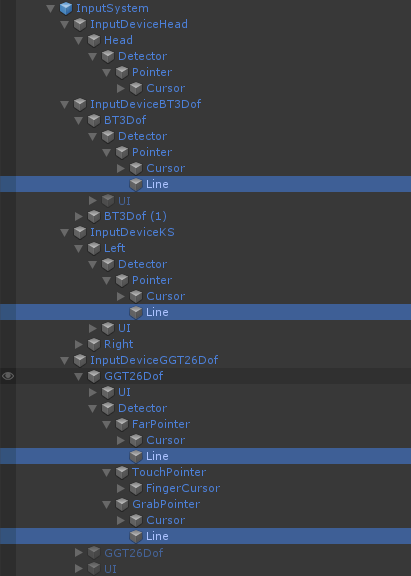
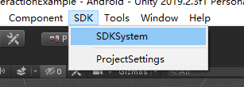

# Module_InputSystem

想要了解SDK中关于**头显，蓝牙手柄，自由手势，游戏控制器**等输入系统的内容，本文将对你有所帮助，具体分如下章节说明：

* 概述
* 术语
* 使用

## 概述

**Module_InputSystem** 是SDK的组成部分，其是最大的一个Module，用于管理系统所有的`数据收集`，`数据处理`，`目标的检测`，`事件的派发` 等，其中包含很多细节，Module_InputSystem的全貌如下图所示：

## 术语

Module_InputSystem由很多部分组成，每个部分各司其职，如下将一些重要部分提出并说明：

- **InputDevices**

    Module_InputSystem 管理系统所有的输入，针对系统输入的不同，定义InputDevice，即输入设备，每个InputDevice代表某类输入

    当前支持的InputDevice如下：

    

    * InputDeviceHead：管理头显输入设备
    * InputDeviceBT3Dof：管理蓝牙手柄输入设备
    * InputDeviceKS：管理游戏控制器输入设备
    * InputDeviceGGT26Dof：管理自由手势输入设备
    
    
    
- **InputDeviceParts**

    针对某个具体InputDevice，可能由多个部分组成，如游戏控制器，由左控制器和右控制器组成，为此提出InputDevicePart概念，InputDevicePart代表输入设备的某个具体部分，当前各个输入设备支持的InputDevicePart如下：

    

    * Head：InputDeviceHead唯一组成部分
    * BT3Dof：InputDeviceBT3Dof 的左/右控制器
    * Left/Right：InputDeviceKS的左/右控制器
    * GGT26Dof：InputDeviceGGT26Dof的左/右手势

- **Detector**

    针对某个InputDevicePart，其需要检测3D世界中的游戏对象并发送事件给游戏对象，这个部分由Detector完成：
    
    如下图所示：
    
    

    Detector主要由多个Pointer组成，每个Pointer负责不同需求的检测任务
    
- **Pointer**

    Detector负责检测3D世界中的游戏对象，针对不同的检测需求，具体又分为多个Pointer去检测，每个Pointer负责某类检测，如下图：

    

    * FarPointer：负责远交互，如头显和蓝牙手柄都是使用此类Pointer
    * TouchPointer：负责手势近触摸交互，主要用于自由手势触摸游戏对象
    * GrabPointer：负责手势近抓取交互，主要用于自由手势近抓取游戏对象

- **Cursor**

    Cursor为Pointer的光标，主要用于显示当前聚焦的位置及状态
    
    

- **Line**

    Line为Pointer的射线，主要用于显示检测的方向及距离
    
    

    
    
    

* **Data**

    针对某个InputDevicePart，Data用于表示此InputDevicePart的所有的数据类，输入设备输入的数据会存放于此
    
* **DataGet**

    针对某个InputDevicePart，需提供具体的数据获取类，DataGet即是用于此目的
* **Status**

    针对某个InputDevicePart，打开或关闭的判断类，用于决定此InputDevicePart是否开启或关闭
* **UI**

    针对某个InputDevicePart，负责UI显示的类，主要用于InputDevicePart可视化的显示功能

## 使用

Module_InputSystem的使用主要分如下两个步骤：

1. 场景中添加Module_InputSystem

2. 启用或关闭InputDevice

### 场景中添加Module_InputSystem
**Module_InputSystem** 的使用非常简单，由于其已经绑定到SDKSystem Prefab中，所以直接在Inspector视图中实例化此Prefab即可：

点击菜单项 SDK->SDKSystem，在inspector视图将添加SDKSystem游戏对象，如下图：

**SDKSystem**游戏对象包含如下：

InputSystem游戏对象即表示Module_InputSystem

### 启用或关闭InputDevice

可以动态的开启或者关闭某些InputDevice，按如下图，找到SDK配置文件 SDKConfiguration.asset文件，配置SDK的一些属性

* **ActiveHead**的值为1 - 开启InputDeviceHead输入设备（头显方式）

* **ActiveGGT26Dof**的值为1 - 开启InputDeviceGGT26Dof输入设备（自由手势方式）

  > InputDeviceGGT26Dof 输入设备开启会自动关闭InputDeviceHead输入设备

* **ActiveBT3Dof** 的值为1- 开启InputDeviceBT3Dof输入设备（蓝牙手柄方式）

  > InputDeviceBT3Dof 输入设备开启会自动关闭InputDeviceHead输入设备

* **ActiveKS** 的值为1- 开启InputDeviceKS输入设备（游戏控制器方式）

  > InputDeviceKS 输入设备开启会自动关闭InputDeviceHead输入设备

* **KSMode6Dof**的值为1- 开启InputDeviceKS输入设备的6Dof模式

> 备注：属性值设置SDK的默认状态，应用运行过程中会生成配置文件，目录为/sdcard/Android/data/packagename/files/SDK_Configs.txt，覆写其中的值可以达到在不重新编译APP的情况下修改SDK的配置

