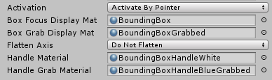
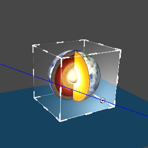
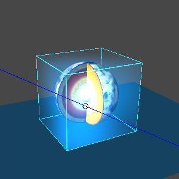
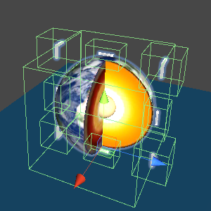
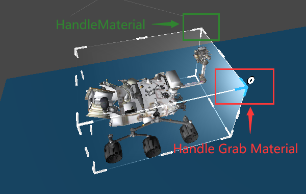
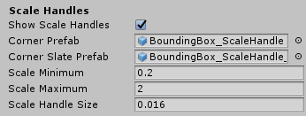
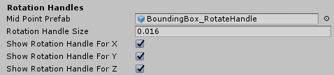
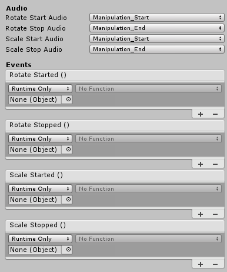

# BoundingBox

BoundingBox可以通过头显，蓝牙手柄，自由手势，游戏控制器对虚拟对象进行动态编辑的组件，修改虚拟对象的Poistion，Rotate，Scale等属性

## 如何使用BoundingBox

将需要缩放和旋转功能的游戏对象挂载`BoundingBox`脚本和`BoxCollider`脚本。

* Activation：交互边框在什么时候激活

  >选择`Active On Start`时，游戏对象会在启动后一直显示可交互边框。
  >
  >选择`Active By Pointer`时，可交互边框只在光标移动上去时才会显示。

* **Box Focus Display Mat**：为光标移动到游戏对象时，可交互边框立方体的材质。

* **Box Grab Display Mat**：为点击或者抓取游戏对象时，可交互边框立方体的材质。

* **Flatten Axis **：可以指定只有跟某个轴垂直的平面方向可被交互，其他平面不可被交互。上图为选择`Flatten X`的结果，多用于2D平面。
  >`Do not Flatten`：不使用平面交互。
  >
  >`Flatten X/Y/Z`：只有与选择的轴垂直的平面有交互。
  >
  >`Flatten Auto`：会自动选择最薄的平面作为可交互的平面，一般会自动选择`Flatten Z`。

* **Handle Material**：表示未被点击时边框的材质。

* **Handle Grab Material**：被点击时边框的材质。

* **Show Scale Handles**：是否启用交互边框的缩放功能。
  >勾选时，启用Scale功能，8个角的边框可见。
  >
  >未勾选时，不启用Scale功能，8个角的边框不可见。

*  **Corner Prefab**：为角边框的预制体模型。
* **Corner Slate Prefab**：为`Flatten Axis`未选择`Do not Flatten`时的角边框预制体模型。

*  **Scale Minimum**：缩放功能的上限值。
*  **Scale Maximum**： 缩放功能的下限值。
*  **Scale Handle Size**：角边框模型的大小。

* **Mid Point Prefab**：侧边框的预制体模型。
* **Rotation Handle Size**：侧边框模型的大小。
*  **Show Rotation Handle For X/Y/Z**：分别代表是否显示X/Y/Z方向上的边框。

*  **Rotate Start/Stop Audio**：旋转开始和结束时的音效。
*  **Scale Start/Stop Audio**：缩放开始和结束时的音效。
*  **Roatate Started/Stopped**：用于注册和注销旋转开始和结束的事件。
*  **Scale Started/Stopped**：用于注册和注销缩放开始和结束的事件。
