# Button

除UGUI的Button外，SDK额外提供了基于Collider的Button，用于手势触碰点击的效果。

## 按钮Prefab
SDK为开发者提供按钮的预制体组件，其位于``SDK\Modules\Module_Interaction\Button\Resources\Prefabs``路径下。

### 基于Image/Graphic(UGUI)的Button
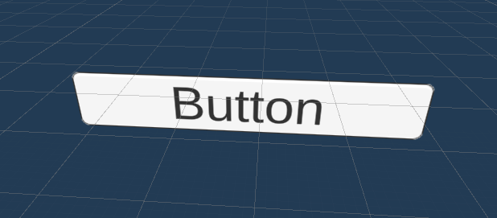

在UGUI Button的基础上添加`NearInteractionTouchableUnityU`I组件，以实现手势触碰触发点击的效果。

### 基于Collider的Button
| 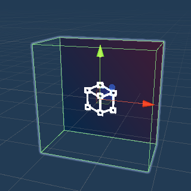 | 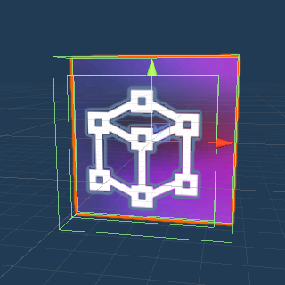 | 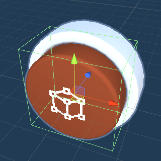 |
| ------------------------------------------------------------ | ------------------------------------------------------------ | ------------------------------------------------------------ |
| SCButton                                                     | SCImageButton3D                                              | SCRoundButton                                                |
| 基本的按钮，在点击和触碰时提供事件触发以及特殊光照效果       | 基于SCImage3D的按钮，使用方法同Image相似，可以自由修改纹理颜色尺寸 | 3D模型按钮，可以根据需求修改对应的模型以及效果               |

由于Collider本身不提供按钮点击事件以及手势触碰事件的触发，因此需要开发者自行实现。SDK中提供了`PressableButton`，用于触发头控射线、手柄射线、远处手势射线、游戏控制器射线的点击事件和动画效果。并且提供了`TouchableButton`，用于触发近处手势的点击事件和动画效果。

## 如何使用PressableButton
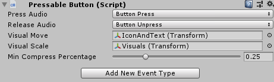

`PressableButton`提供了在使用射线的情况下(包括头控射线，手柄射线，手势射线，游戏控制器射线)，按钮被按下、抬起、点击、进入、退出等事件，同时还提供了按钮被点击和抬起时的动画和音效。

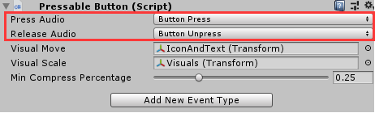

此组件的部分参数如下：
* **Press Audio**：按钮被按下时发出的音效。
* **Release Audio**：按钮被抬起时发出的音效。

如果需要自定义的音效，可以修改位于`SDK\Modules\Module_AudioSystem\Resources\Configs`下的`SCAudiosConfig.asset`资源文件，添加对应的`AudioClip`以及创建自定义枚举。

此组件的部分参数如下：
* **Visual Move**：赋值的游戏对象的z坐标会在按钮按下抬起时发生变化，
* **Visual Scale**：赋值的游戏对象的z缩放会在按钮和抬起时发生变化。
* **Min Compress Percentage**：按钮按下的幅度，比如当前值为0.25时，z坐标移动/缩放到当前值25%。

此组件的部分参数如下：
* **Add New Event Type**：按钮的使用方法同UGUI中的`Event Trigger`组件的使用方法相同，选择相应的事件名称，添加对应的事件触发方法。

## 如何使用TouchableButton
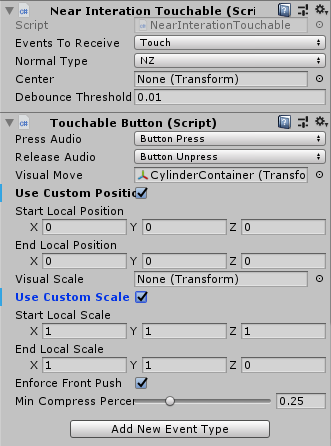

`TouchableButton`提供了在使用近触手势的情况下，按钮被按下、抬起、持续按下、进入、退出等事件，同时还提供了按钮被点击和抬起时的动画和音效。
使用`TouchableButton`的前提是该游戏对象上面必须有`NearInteractionTouchable`脚本(3D物体)或者`NearInteractionTouchableUnityUI`脚本(UGUI)。这两个脚本用于让近触手势能够检测到该游戏对象。
当`Event Type Receive`选择Touch时，触发的事件为`PokeUp`、`PokeDown`，`PokeUpdate`。
当`Event Type Receive`选择Pointer时，触发的事件为`PointerUp`、`PointerDown`、`PointerEnter`、`PointerExit`和`PointerClick`。
一般情况下，基于Collider的按钮的`Event Type Receive`选择Touch，而基于UGUI的按钮会选择Pointer，这样就可以触发UGUI自定义的事件。

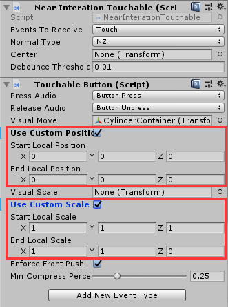

此组件的部分参数如下：
* `TouchableButton`除了提供了和`PressableButton`相同的属性之外，额外提供了`Use Custom Position`和`Use Custom Scale`选择框。
* 当选择了`Use Custom Position`，则开发者可以手动设置`Visual Move`中已赋值的游戏对象的起始位置和结束位置。
* 当选择了`Use Custom Scale`，则开发者可以手动设置`Visual Scale`中已赋值的游戏对象的起始缩放和结束缩放。

此组件的部分参数如下：
* 对于`Box Collider`碰撞体，使用者不仅仅可以通过正面去点击，也可以通过侧面去点击。大部分情况下从侧面点击触发按钮事件是开发者不希望得到的结果。`Enforce Front Push`约束按钮只有通过`Box Collider`正面去点击才会触发按钮点击事件。
* 由于在Touch模式下只会触发`PokeUpdate`事件，因此按钮点击的触发需要通过`Min Compress Percentage`去判断，比如当前值为0.25时，表示当按钮被按压到25%的时候会触发'Poke Press'回弹到75%时会触发'Poke Release'。

## 如何实现自定义Button
如果只是想实现射线相关的点击操作，如头控、手柄射线、手势射线。则使用Unity自带的事件接口即可，如`IPointerEnterHandler`、`IPointerDownHandler`、`IPointerClickHandler`、`IPointerUpHandler`、`IPointerExitHandler`等。

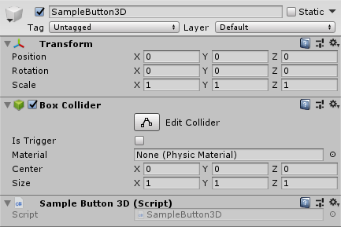

如果为3D游戏对象，需要添加Collider组件以及实现对应事件接口的脚本。

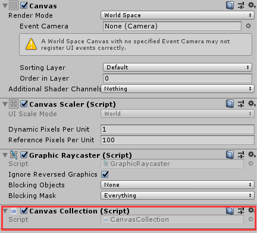

如果为UGUI游戏对象，需要在Canvas游戏对象上添加`CanvasCollection`组件。然后直接使用UGUI原生的组件即可(如`Button`组件)。

---

如果要实现近触相关的操作，比如用食指点击按钮。

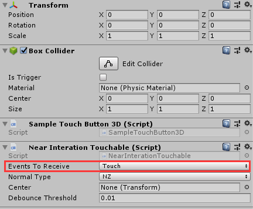

对于3D游戏对象，首先需要添加Collider组件(最好为`BoxCollider`)和`NearInterationTouchable`组件，然后实现SDK提供的额外事件接口`IPokeUp`、`IPokeDown、`IPokeUpdate`。

对于UGUI游戏对象，除了需要在Canvas组件上添加`CanvasCollection`之外，还需要在UI相关游戏对象上添加`NearInteractionTouchableUnityUI`脚本，同时修改`Event Type Receive`类型为Pointer