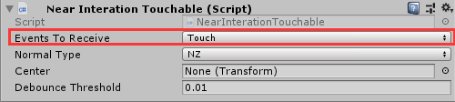
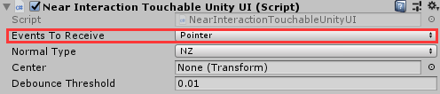
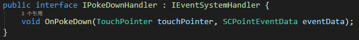
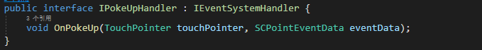
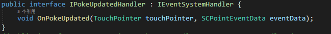

# HandTouch

**HandTouch**模块为开发者提供用自由手势去对游戏对象进行近距离交互的功能。

近处手势交互和射线相关交互(如鼠标、触屏、头部射线、手柄射线、远处手势射线等)不同。手势的判断分两步，第一步先判断以手部模型食指为球心的球体范围内的物体是否带有`BoxCollider`和`NearInteractionTouchable`组件，或者只带有`NearInteractionTouchableUnityUI`组件。第二步再根据符合条件的游戏对象与食指指尖的距离来触发相应的事件。

## 如何使用HandTouch

对于3D物体，需要挂载'BoxCollider'脚本和'NearInteractionTouchable'脚本，这样该游戏对象就会收到近触手势的事件。`Events TO Receive`选择为`Touch`时，收到的事件为PokeDown、PokeUp、以及PokeUpdate。当选择`Pointer`时，收到的事件为PointerDown、PointerUp、PointerClick，也就是基于Unity自带事件系统中的事件。

对于UGUI物体，需要挂载`NearInteractionTouchableUnityUI`脚本。由于一般UGUI自带事件交互相关的脚本(如Button等)，所以一般选择`Events To Receive`的值为`Pointer`，来更快的适配UGUI。

## 手势特有的事件类型

* PokeDown，PokeUp，PokeUpdate为SDK为近触手势额外添加的事件类型。

* OnPokeDown在食指指尖进入碰撞体时触发。

* OnPokeDown在食指指尖离开碰撞体时触发。

* 在OnPokeDown触发后，OnPokeUpdate会在每一帧都触发，当OnPokeUp触发后，OnPokeUpdate停止触发。

**扩展：**SDK提供了`PokeHandler`脚本，位于`SDK\Modules\Module_Interaction\HandTouch\Scripts`路径下，开发者可以仿照或者继承该脚本重写其中的虚方法。