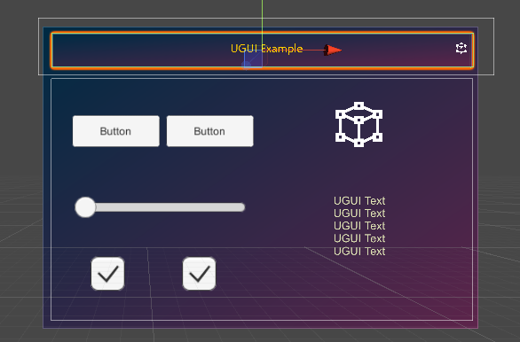
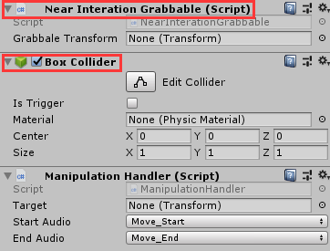
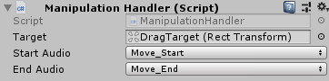
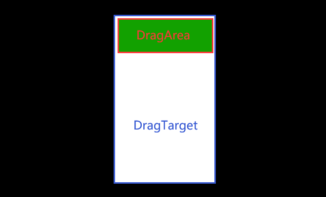

# ManipulationHandler

**ManipulationHandler**模块为开发者提供了两只自由手势同时对游戏对象进行交互操作的功能。

## 如何使用ManipulationHandler

* SDK为开发者提供了双手交互的组件，其位于`SDK\Modules\Module_Interaction\ManipulationHandler\Scripts\ManipulationHandler.cs`处。将此组件拖拽进需要此功能的游戏对象即可

* 带有`ManipulationHandler`的游戏对象或者其子游戏对象至少挂载有`BoxCollider`或者继承自UGUI中`Graphic`的组件，比如`Image`、`RawImage`、`Text`等。同时还需要挂载有`NearInterationGrabbable`组件，用于近处手势的拖拽操作。
>挂载UGUI相关的组件，需要在Canvas所在的游戏对象上挂载`CanvasCollection`组件

## ManipulationHandler的参数解析

此组件的参数如下：

* Target：被拖拽控制的游戏对象。
>将想被拖拽的物体挂载到Target上面，这样就可以实现拖拽子游戏对象带动父游戏对象拖动。

* Start Audio：拖拽开始时触发的音效。
* End Audio：拖拽结束时触发的音效。