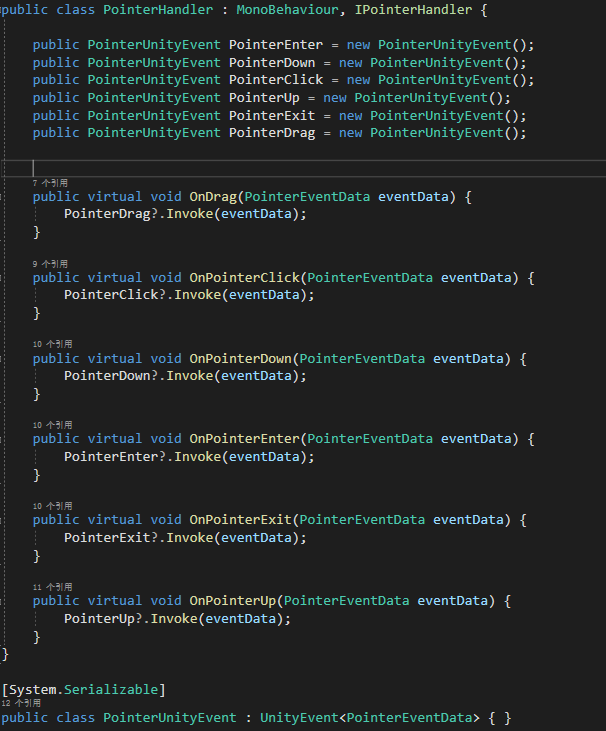

# PointerHandler

**PointerHandler**模块在于提供将Unity中的一些常用的事件整合的接口供开发者使用，其中包括IPointerExitHandler、IPointerEnterHandler、IPointerDownHandler、IPointerClickHandler、IPointerUpHandler、IDragHandler。

## 如何使用PointerHandler

SDK为开发者提供了'PointerHandler'脚本，位于`SDK\Modules\Module_Interaction\PointerHandler\Scripts`路径下，开发者可以直接使用或者重写其中的虚方法。

>如果近处手势想要触发PointerHandler中的事件，请向3D游戏对象上挂载`BoxCollider`组件和`NearInteractionTouchable`组件，并将`Events To Receive`的值设为`Touch`。如果是UGUI对象，请向游戏对象上挂载`NearInteractionTouchableUnityUI`组件,并将`Events To Receive`的值设为`Pointer`。