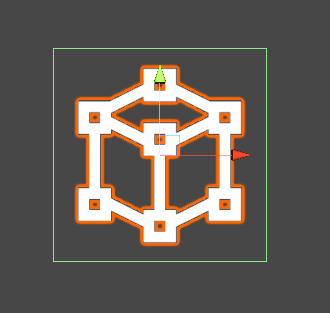
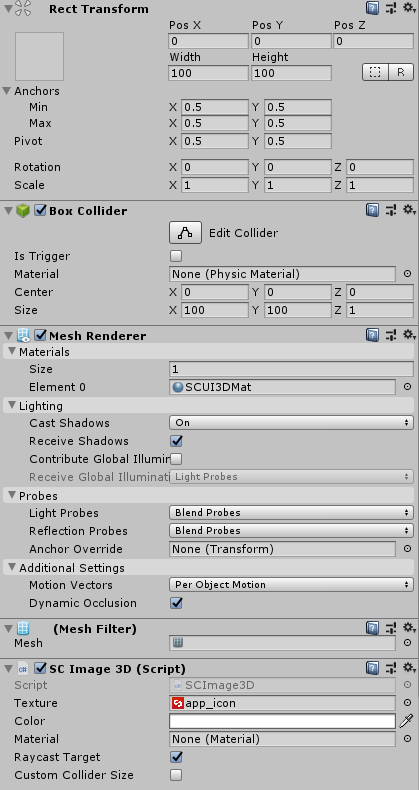
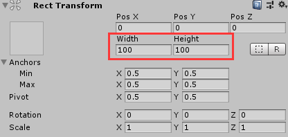
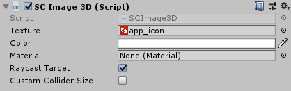

# SCImage3D

XR应用的需求很多时候需要对UI界面进行整体的拖拽。但是由于UGUI使用的局限性，比如ZTest是按照Hierarchy中的顺序来判断，射线检测使用`GraphicRaycast`，必须要在`Canvas`组件下才能渲染等。这些局限导致UGUI不太适合整体的拖拽，有可能导致按钮无法触发点击，渲染效果和预期不一致等问题。因此SDK提供了基于`MeshRenderer`和`BoxCollider`的`SCImage3D`组件来规避UGUI中`Image`的局限性。

## 如何使用SCImage3D

### 创建SCImage3D组件
* SDK为开发者提供的预制体组件位于`SDK\Modules\Module_Interaction\SCImage3D\Resources\SCImage3D.prefab`处，将此预制体组件拖拽进场景即可。

* 通过在Hierarchy面板右键SC3DUI/SCImage3D创建，在场景中生成此预制体。

> `SCImage3D`可以脱离`Canvas`直接放置在场景中，并且使用的是`MeshRenderer`以及`BoxCollider`，使用方法和UGUI的`Image`基本相同。

### 设置组件属性
* 通过设置RectTransform去控制图片的尺寸。

## SCImage3D的参数解析

此组件的参数如下：
*  **Texture**：属性用来设置显示的图片。
*  **Color**：属性用来设置显示的颜色。
*  **Material**：属性用来自定义材质。
>自定义材质的Shader中，采样器名称必须为_MainTex，颜色属性的名称必须为_Color，否则使用自定义材质后可能导致`Texture`和`Color`属性的设置无效。

* **Raycast Target**：用来控制`BoxCollider`的`enable`属性。
* **Custom Collider Size**：是否根据图片的尺寸自动适配。
>在没有勾选的情况下，`BoxCollider`的`Center`属性和`Size`属性会根据图片的尺寸自动适配。(自动适配仅限于x轴和y轴，z依然轴可以手动设置)
>
>在勾选的情况下，则开发者可以手动设置`BoxCollider`的`Center`属性和`Size`属性。
