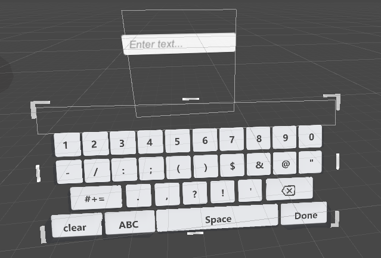
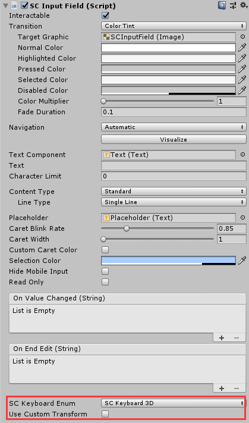
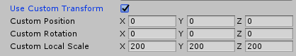
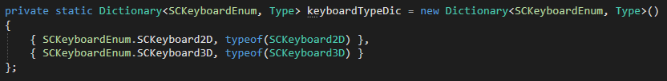

# SCInputField

**SCInputField**模块用于处理需要在设备中输入文字的情况。

## 如何使用SCInputField

* SDK为开发者提供的输入框预制体组件位于`SDK\Modules\Module_Interaction\SCInputField\Resources\SCInputField.prefab`处，将此预制体组件拖拽进场景即可。
* 通过在Hierarchy面板右键SC3DUI/SCInputField，在场景中生成输入框组件。
* 键盘预制体组件位于`SDK\Modules\Module_Interaction\SCInputField\Resources\Keyboard`下面，将其拖拽进场景中即可。

## SCInputField的参数解析

除`SC Keyboard Enum`和`Use Custom Transform`字段外，`SCInputField`和UGUI中的`InputField`的字段一致。

此组件的参数如下：
* **SC Keyboard Enum**：使用哪个类型的3D键盘。
>目前只支持SCKeyboard3D选项。

* **Use Custom Transform**：是否自动适配3D键盘出现的位置信息。

>`Use Custom Transform`未勾选时，点击`SCInputField`之后呼出的键盘位于头部朝向的下方位置。
>`Use Custom Transform`勾选时，开发者可以自定义呼出键盘的Transform属性。

**注意：**无论是否勾选`Use Custom Transform`，键盘都会根据头部转动的方向，调整键盘的位置到头部朝向的下方。

## 如何实现自定义Keyboard
开发者可以参照`SCKeyboard3D`脚本，位于`SDK\Modules\Module_Interaction\SCInputField\Resources\Keyboard\Scripts\SCKeyboard3D.cs`处。

将自定义键盘类继承自`SCKeyboardBase`脚本，位于`SDK\Modules\Module_Interaction\SCInputField\Resources\Keyboard\Scripts\SCKeyboardBase.cs`处。

创建新的枚举到SCKeyboardEnum中，并将枚举名称和创建的键盘类型添加到`keyboardTyeDic`字典中。
