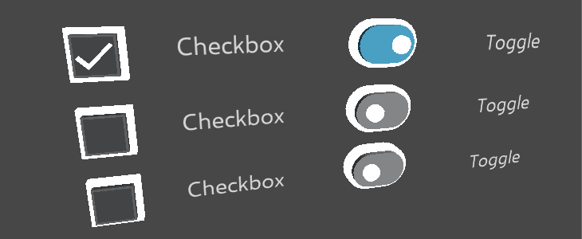
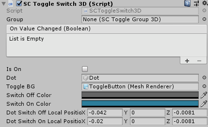
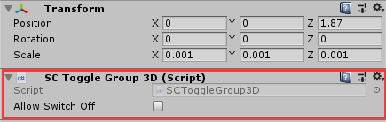
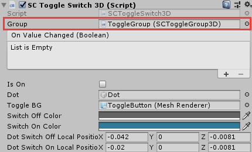

# SCToggle3D

**SCToggle3D**模块是基于Collider的3D开关。

## 如何创建SCToggle3D组件
SDK提供了两种类型的开关，一种为Toggle，另一种为Switch。

**SCToggleCheckbox3D的创建**
* SCToggleCheckbox3D的预制体组件位于`SDK\Modules\Module_Interaction\SCToggle3D\Resources\Prefabs\SCToggleCheckbox3D.prefab`处，将此预制体组件拖拽进场景即可。
  
  >可以通过射线点击来控制中间对勾的显隐。

**SCToggleSwitch3D的创建**
* SCToggleSwitch3D的预制体组件位于 `SDK\Modules\Module_Interaction\SCToggle3D\Resources\Prefabs\SCToggleSwitch3D.prefab`处，将此预制体组件拖拽进场景即可。
  
  >可以通过射线点击来控制中间开关圆点的颜色和位置。

## SCToggle3D的参数解析

**SCToggleCheckbox3D的参数解析**

此组件的参数如下：
* **Group**：此选项属于哪个组别。
* **On Value Changed**：在选项被点击时触发事件，
* **Is On**：选项是否被勾选。
  
  >可以通过点击设置也可以通过代码去设置。
* **Check Object**：选项UI框的显隐。
  
  >会根据`Is On`的值显示或者隐藏。

**SCToggleSwitch3D的参数解析**

此组件的参数如下：
* **Group**：此选项属于哪个组别。
* **On Value Changed**：在选项被点击时触发事件，
* **Is On**：选项是否被勾选。
  
  >可以通过点击设置也可以通过代码去设置。
* **Dot**：开关的圆点模型。
* **Dot Switch On Local Position**：当开关开启时会移动到`Dot Switch On Local Position`的位置。
* **Dot Switch Off Local Position**：开关关闭时会移动到`Dot Switch Off Local Position`的位置。
* **Toggle BG**：开关的背景`MeshRenderer`对象。
* **Switch On Color**：当开关开启时颜色为`Switch On Color`。
* **Switch Off Color**：开关关闭时颜色为`Switch Off Color`。
  
  >如果想要使用自定义的材质，需要材质的Shader中有名称为`_Color`的属性

## 为Toggle分组
有时候开发者希望同一时间内，一组Toggle中同一时间只能有一个Toggle被选中，建议如下：
* 将这些Toggle指定同一个父级游戏对象，并在游戏对象上挂载`SCToggleGroup3D`组件。

* 在`Group`字段挂载同一个`SCToggleGroup3D`就可以实现将Toggle放在同一组。

