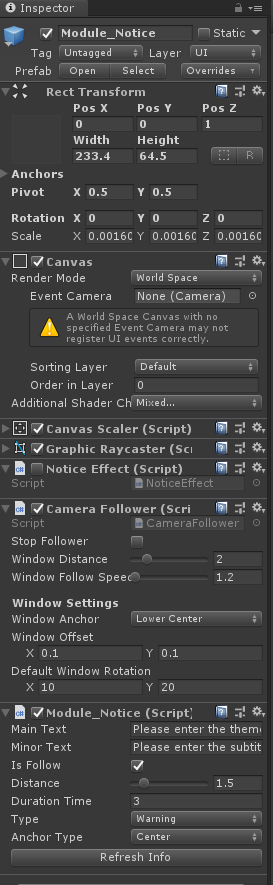

# Module_Notice
Module_Notice模块在于为开发者提供可在设定条件下触发的提示弹框功能。

## Module_Notice模块的创建与使用

Module_Notice的Prefab位于`SDK\Modules\Module_Notice\ Resources\Prefabs\Module_Notice.prefab` 。将此预制体拖拽进场景中,然后再Inspector中编辑Module_Notice组件的参数信息即可。

此模块为开发者提供了一些API接口，供开发者使用，如下列API接口：
* `Show`：启动提示弹框功能。
* `Close`：关闭提示弹框功能。
* `SetNotice`：编辑提示弹框的基本信息。
* `AddStrs`：编辑多个提示弹框的主副标题文本。
* `ShowMultipleNotice`：启动多个提示弹框功能。
* `CloseMultipleNotice`：关闭多个提示弹框功能。

## Module_Notice的DeviceList参数解析

Module_Notice组件中`Main Text`表示弹框的主标题。
`Minor Text`表示弹框的副标题。
`Duration Time`表示弹框显示的持续时长。
`IsFollow`表示是否开启跟随相机功能。
`Type`表示弹框的提示类型。
若`IsFollow`选择为True，其中`Distance`表示弹框跟随相机的相对距离。
`Anchor Type`表示弹框跟随相机的相对锚点位置。

Notice Effect组件为弹框显示的效果。
Camera Follower组件为跟随相机的功能组件。详情可参照Module_Follower模块。

 **扩展**：通过上列API接口或者参照此模板组件，开发者可自由编辑或者扩展自己所需的提示弹框。

