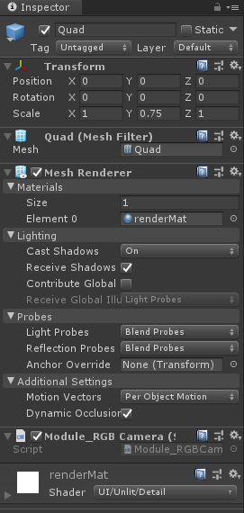

# Module_RGBCamera
Module_RGBCamera在于为开发者提供获取XR设备的RGB相机数据功能。

## Module_RGBCamera的创建和使用

* RGBCamera的Prefab位于`SDK\Modules\Module_RGBCamera\ Resources\Prefabs\FirsetView.prefab` 处，将此预制体拖拽进场景中,然后调整FirstView游戏对象在场景中的位置即可。

