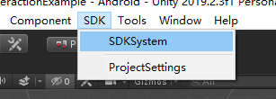

# Module_SDKSystem
**Module_SDKSystem**模块在于管理SVR模块和InputSystem模块，使用SDK，最直接的方法就是在场景中添加此模块。

## Module_SDKSystem模块的创建

SDK的使用，直接创建此模块即可，如下三种方式选择其一即可：

* 开发者可通过在Hierarchy视图处单击右键,选中`SDK>SDKSystem`即可在场景中生成`SDKSystem`游戏对象。

* 在Unity的菜单栏处,选中`SDK>SDKSystem`即可在场景中生成`SDKSystem`游戏对象。

  

* `SDKSystem`的预制体位于`SDK\Modules\Module_SDKSystem \Resources\Prefabs\SDKSystem.prefab`处,将此预制体拖拽进场景中即可。

**注意:**此模块只能在支持的XR眼镜设备上使用。

   
