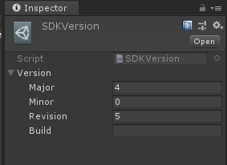

# Module_SDKVersion
**Module_SDKVersion**模块在于为开发者提供查询当前SDK的版本号功能。

## Module_SDKVersion的使用

此模块为开发者提供了API接口，供开发者使用，如下列部分API：
*  **Version**：获取当前应用使用SDK的版本号。

## Module_SDKConfiguration的S配置参数解析

此配置的参数如下：

* **Major**：SDK当前主版本号。
* **Minor**：SDK当前的主版本下的次版本号。
* **Revision**：SDK当前次版本的修正版本号。
* **Build**：SDK当前的编译版本号。

