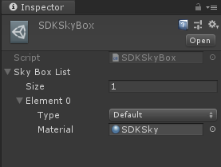

# Module_SkyBox
**Module_SkyBox**模块在于为开发者提供配置场景的天空盒背景功能。

## Module_SkyBox的使用

此模块为开发者提供了API接口，供开发者使用，如下列部分API：
*  **GetSkyBox**：获取当前场景的天空盒类型。

## Module_SkyBox的配置参数解析

此配置的参数如下:
* **Element**：天空盒配置列表中一个元素。
* **Type**：天空盒类型名称。
* **Material**：配置的天空盒材质。

**扩展**：开发者可参照此模块扩展自己所需的天空盒背景材质。

