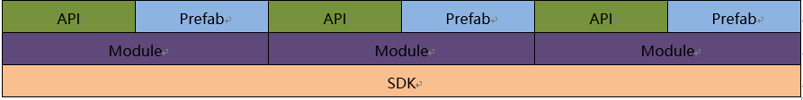
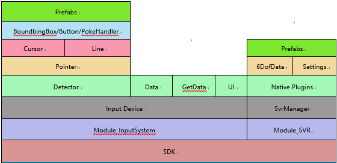

# Architecture overview

This article provides an overview of the SDK. It describes the design philosophy and composition of the SDK.

## Design philosophy of SDK

Based on the considerations of the robustness and scalability of the ecosystem from which the SDK platform was derived, the design philosophy of SDK can be summarized in one sentence: "`Everything is a Module`".

A` Module` is an independent collection of functions, which can also be called a Component. A `Module` may depend on other `Modules`.

The SDK Modules provide an API and Prefabs.

### References
* [For further information about Prefabs ](https://docs.unity3d.com/Manual/Prefabs.html)

## SDK core Modules

The two core Modules included in SDK are Module_InputSystem and Module_SVR:

•	**Module_InputSystem** - an input system Module, responsible for managing all input devices (Head-Mounted Display/Controller/Hand Tracking)

•	**Module_SVR** - a Module that interacts with the bottom layer of the system, responsible for obtaining SLAM data

The outline of SDK is illustrated below:

### References 

* [Detailed description of Module_InputSystem](./Module/Module_InputSystem.md)

* [Detailed description of Module_SVR](./Module/Module_SVR.md)
