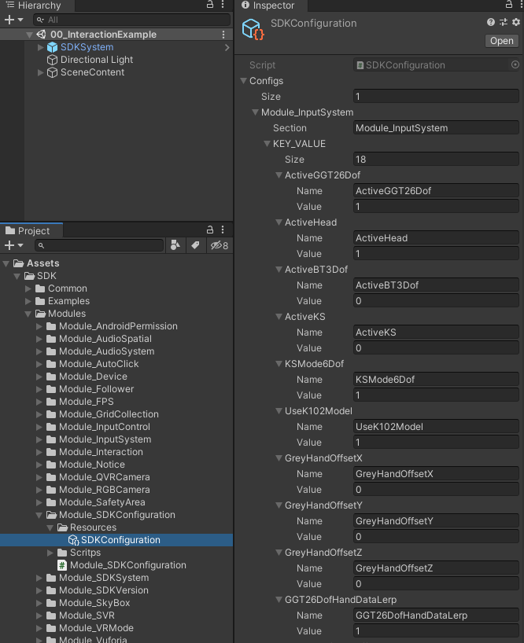

# Getting started tutorials


## Overview

**Welcome to the getting started tutorials !**

You will learn the features and functions provided by SDK in the tutorials. If you have a  XR device, you may experience the real effect of the project you designed on the device. This will speed up your project development process.

The getting started tutorials include the following content in order:

1. **Required preparation**
2. **Interactions with virtual objects using the Head-Mounted Display (HMD) mode, the Controller mode, and the Hand Tracking mode**
3. **Other interactive operations**


## 1. Required preparation
Before starting the tutorials, please read the following document to complete the required preparation:

* [Getting started with SDK](Getting started with SDK.html)

> “Getting started with SDK” will guide you how to download SDK and how to use it.


  

## 2. Interactions with virtual objects using the HMD mode, the Controller mode, and the Hand Tracking mode

This section will provide you the following guidelines:

* Add interactive virtual objects

* Turn on/off InputDevice

* Turn on the head-mounted display mode

* Turn on the Controller mode

* Turn on the Hand Tracking mode

  


#### Add interactive virtual objects

To demonstrate the different interactive modes provided by SDK, you will need to create an interactive 3D virtual object first. In this section, we will use SCButton that comes with SDK as the interactive object.

To add **SCButton** to Scene, please simply click the menu **GameObject > SDK > SCButton**


#### Turn on/off InputDevice

You can dynamically turn on or turn off 'InputDevice's, as shown below, find the SDKConfiguration.asset file from the SDK for properties configuration



* **ActiveHead=1** - Turn on the 'InputDeviceHead' (HMD mode)

* **ActiveGGT26Dof=1** - Turn on the 'InputDeviceGGT26Dof' (Hand Tracking mode)

  > Enabling 'InputDeviceGGT26Dof' will automatically disable 'InputDeviceHead' 

* **ActiveBT3Dof=1** - Turn on the 'InputDeviceBT3Dof' (3Dof Controller via Bluetooth)

  > Enabling 'InputDeviceBT3Dof' will automatically disable 'InputDeviceHead' 

* **ActiveKS=1** -  Turn on the 'InputDeviceKS' (For K series Game Controllers Only)

  > Enabling 'InputDeviceKS' will automatically disable 'InputDeviceHead'

* **KSMode6Dof=1**- Turn on the 6Dof mode of 'InputDeviceKS' (For 6Dof Only)


> Note: The values of the properties set the default state of the SDK. The configuration file will be generated at Runtime at  /sdcard/Android/data/packagename/files/SDK_Configs.txt. Overwriting those values can modify the SDK configuration without recompiling the APP.


#### Turn on the HMD mode

The HMD mode refers to the mode in which user ONLY uses buttons on the XR device and the posture of the device to operate virtual 3D objects.
To turn on the HMD mode, please set 'ActiveHead'=1

Then click the 'Play' button to run the application, this way you can simulate the behavior of the XR device via your mouse and keyboard:

* Long press the key **<kbd>W/A/S/D</kbd>**  to **move the viewing angle  forward/left/backward/right**
* Long press the **<kbd>right mouse button</kbd>** and **move the mouse to rotate the viewing angle**

Then move the cursor to 'SCButton' and click the **<kbd>left mouse button</kbd>** to trigger Click. Now the interaction with 'SCButton' through the HMD mode is complete.


#### Turn on the Controller mode

The Controller mode refers to the mode in which user uses controller(s) that come with the XR device and the posture of the device to operate virtual 3D objects.

To turn on the Controller mode, please set 'ActiveBT3Dof'=1 (Enabling K02/K07 series) or  'ActiveKS'=1 (Enabling K11/K101/K102)

> K02/07 supports 3Dof ONLY, K11/101/102 supports 3Dof/6Dof
>
> The HMD mode will be disabled automatically if both the Controller mode and the HMD mode are turned on

Similar to the HMD mode, please move the cursor to 'SCButton' and click the  **<kbd>left mouse button</kbd>**  to trigger Click. Now the interaction with 'SCButton' through the Controller mode is complete.


####  Turn on the Hand Tracking mode

The Hand Tracking mode refers to the mode in which user uses the built-in hand tracking feature of the XR device and the posture of the device to operate virtual 3D objects.

To turn on the Hand Tracking mode, please set 'ActiveGGT26Dof'=1

> The HMD mode will be disabled automatically if both the Hand Tracking mode and the HMD mode are turned on

Similar to the HMD mode, please move the cursor to 'SCButton' and click the **<kbd>left mouse button</kbd>**  to trigger Click. Now the interaction with 'SCButton' through the Hand Tracking mode is complete.


## 3. Other interactive operations

This section will provide you other supported interactive operations including:

* Common event interactions
* Drag and drop interactions
* Hand Tracking click interactions
* Some interactive components


### Common event interactions
Common event interactions refer to the event interactions supported by the Unity EventSystem (which is fully supported in this SDK). Please find instructions as follows:

* Implement the interfaces
* Use the EventTrigger component
* Inherit PointerHandler

#### Implement the interfaces

You may directly implement the interfaces provided by Unity to listen to events. Commonly used event interfaces are as follows:

	IPointerExitHandler //event triggered by exiting focus
	IPointerEnterHandler //event triggered by entering focus
	IPointerDownHandler //event triggered by press down
	IPointerClickHandler //event triggered by clicking
	IPointerUpHandler //event triggered by press up
	IDragHandler //event triggered by dragging
> Please refer to the namespace: UnityEngine.EventSystems. For more detailed description, please check Unity’s official website: https://docs.unity3d.com/Packages/com.unity.ugui@1.0/manual/EventSystem.html.


#### Use the EventTrigger component

Here refer to the EventTrigger event listener component provided by the Unity EventSystem
> For more detailed description, please check Unity’s official website:https://docs.unity3d.com/Packages/com.unity.ugui@1.0/manual/script-EventTrigger.html


#### Inherit PointerHandler

SDK provides an encapsulated PointerHandler class for developers to use. It is similar to the EventTrigger component, which implements common event interfaces, as shown below:

``` csharp
public interface IPointerHandler : 
    IPointerExitHandler, 
    IPointerEnterHandler, 
    IPointerDownHandler,
    IPointerClickHandler,
    IPointerUpHandler, 
    IDragHandler{
}
```
``` csharp
public class PointerHandler : MonoBehaviour, IPointerHandler {
...
}
```

> The 'PressableButton' from 'SCButton' Prefab by the SDK is derived by inheriting from the PointerHandler.


### Drag and drop interactions

Drag and drop interactions will achieve the purpose of moving virtual objects by long-pressing and dragging. The operation of dragging and dropping objects in the SDK is very straightforward. You may directly add ManipulationHandler to the draggable virtual objects and simply configure some of their properties.

The following steps demonstrate how to use drag and drop interactions:

**Step 1: Add virtual game objects**

Drag and drop the EarthCore game object from the following directory to the Scene view:

`Assets/SDK/Examples/StandardAssets/Prefabs/EarthCore.prefab`

**Step 2: Configure the 'Transform' property and set**:

* **Position** x=0.2f ,y =0, z = 0.5f
* **Rotation**: x = 0, y = 0, z = 0
* **Scale** x=10, y= 10, z=10

**Step 3: Add BoxCollider**

Expand EarthCore in the Hierarchy window, add the BoxCollider component to its child object node_id30, and configure the properties of BoxCollider as below:

* **Center** x=0, y=0.1, z=0

* **Size** x=0.2f, y=0.2f, z=0.2f

**Step 4: Add the ManipulationHandler component**

Add the ManipulationHandler component to the EarthCore’s child object node_id30, and configure the properties as below:

**Target**: assign the value as the EarthCore game object


Then click the run button, move the cursor to EarthCore, then press and drag the  **<kbd>left mouse button</kbd>** . Now you see the drag and drop interaction against EarthCore

> Drag and drop interactions support the HMD mode, the Controller mode and the Hand Tracking mode.


### Hand Tracking click interactions

Hand Tracking interactions refer to the interactions of using a finger to touch a virtual object to trigger the click event. The SDK provides following components for the Hand Tracking click interactions:

* **PokeHandler**

  PokeHandler is used to listen to the following finger touch events:

  * PokeDown - Finger enters the virtual object Collider, which is called once
  * PokeUp - Finger leaves the virtual object Collider, which is called once
  * PokeUpdated - Keep the finger on the virtual object Collider, which is called by every frame

* **TouchableButton**

It is a button component based on PokeHandler

The following steps demonstrate how to use the Hand Tracking click interactions:

**Step 1: Add a virtual game object：**

Drag and drop the TouchableObject game object from the following directory to the Scene view:

`Assets/SDK/Examples/StandardAssets/Prefabs/TouchableObject.prefab`

**Step 2: Configure the 'Transform' property and set：**

* **Position** x=-0.2f ,y =0, z = 0.5f
* **Rotation** x = 0, y = 0, z = 0
* **Scale** x=1, y= 1, z=1

**Step 3: Add the HandInteractionTouchRotate component：**

The HandInteractionTouchRotate component inherits from PokeHandler. Please add the HandInteractionTouchRotate component to FrontPlate, the child object of TouchableObject, and configure the properties as below:

* **TargetObjectTransform:** assign the value as Platonic (1), the child object of TouchableObject

**Step 4: Configure the properties of NearInteractionTouchable：**

The NearInteractionTouchable component indicates that the game object is Touchable. Adding the PokeHandler component will add this component automatically.  Please ensure the following properties of the NearInteractionTouchable component are set:

* **Events To Receive:** Touch


Then turn on the Hand Tracking mode, click the Run button, and simulate the behavior in the XR device via your mouse and keyboard:

* Long press the key  **<kbd>W/A/S/D</kbd>**  to **move the viewing angle forward/left/backward/right**

Please move the index finger in and out, and keep it on the TouchableObject to see the effect.


**Step 5: Add TouchableButton：**

Please click the menu Game Object > SDK > SCButton to add an SCButton, and ensure the properties are configured as below.

**Step 6: Configure the 'Transform' property and set：**

* **Position** x=-0.1f, y =0, z = 0.45f
* **Rotation** x = 0, y = 0, z = 0
* **Scale** x=1, y= 1, z=1

**Step 7: Mount the TouchableButton component on the SCButton object：**

The TouchableButton component indicates that SCButton is a Button that can be touched by nearby hand

> Adding the TouchableButton component will add the NearInteractionTouch component automatically.
>
> The NearInteractionTouch component has the ability to be touched by nearby hand.


Then turn on the Hand Tracking mode, click the Run button, and simulate the behavior in the XR device via your mouse and keyboard:

*  Long press the key **<kbd>W/A/S/D</kbd>**  to **move the angle of view forward/left/backward/right**

Please click 'SCButton' with your index finger to see the effect.


### Some interactive components

SDK provides some interactive components to facilitate the interactive operations for developers:

* **BoundingBox**

BoundingBox is a component that can edit virtual objects dynamically using the HMD mode, the Controller mode, and the Hand Tracking mode. It can modify the properties of a virtual object, such as Position, Rotate, Scale, etc. For more details, please see the introduction of Module_BoundingBox. 


* **ManipulationHandler**

ManipulationHandler can move, zoom, and rotate the virtual objects with both hands or with one hand. For more details, please see the introduction of ManipulationHandler


## Congratulations

You have had a preliminary understanding of the interactive operations of the SDK. To gain more comprehensive experience, you can try the Example application included in the **SDK.Example.unitypackage**, such as:

`Assets/SDK/Examples/HandTracking/Scenes/00_HandInteractionExample.unity`

In this Example application, you may find all supported interactive operations provided by the SDK.


