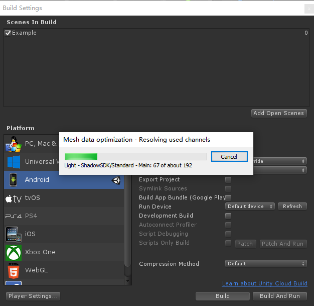

# **Getting started with SDK**

**SDK** stands for **Software Development Kit**, which is a collection of the related documents, examples, tools, and APIs required to develop virtual/mixed reality applications running on the  XR devices. SDK provides a complete development environment and the most optimized device access mode, which will enable you to develop applications quickly and efficiently.

>  XR devices refer to MR/AR/VR devices 

This tutorial includes the following content in order:

1. Preparation
2. Completing the first SDK project
3. References

## 1. Preparation
Before start using the SDK, you need to have the following software and devices:
* [Visual Studio 2019](https://visualstudio.microsoft.com/downloads/)
* [Unity Hub](https://docs.unity3d.com/Manual/GettingStartedInstallingHub.html) with Unity installed and the Android Platform Build Support module added
> Note: the recommended version is Higher than version Unity2019.2.3f1(Except Unity2019.3.X) . There is a memory leak problem existing in the version 2019.3.X
* Android SDK (API level 26 and higher)
*  XR devices

## 2. Completing the first SDK project

You will learn the following topics in this section:

* Create a new Unity Project, download and import SDK, and configure ProjectSettings
* Use SDK to build the first project and install it on a  XR device

#### You may follow the following steps to complete your first project：

**Step 1**: Get the latest version of the SDK UnityPackages

**Step 2**: Create a new Unity Project

**Step 3**: Switch to Android Platform

**Step 4**: Import the TextMeshPro related package

**Step 5**: Import SDK

**Step 6**: Configure ProjectSettings

**Step 7**: Create a new Unity Scene and add SDKSystem

**Step 8**: Build Android Application

**Step 9**: Install the compiled APK to the  XR device

#### Step1: Get the latest version of the SDK UnityPackages

1. Go to the [SDK release page](https://github.com//UnitySDK)
2. Download the following unitypackages:
   * **Required** SDK.Foundation.unitypackage
   * **_Optional_** SDK.Examples.unitypackage

> For the content included in the unitypackage, please refer to [SDK PackageContents](SDK unitypackages.html)

#### Step 2: Create a new Unity Project

1. Open UnityHub

2. Select the Projects tab

3. Click on the inverted triangle symbol on the upper right corner

4. Select the Unity version from the prepopulated list of the recommended versions

> If the recommended version of Unity is not installed, please download and install it from the Unity official website.

Please ensure the following in the newly created project window, and then click Create:

* Template “3D” is selected
* No special characters are used in the file path and in the project name

#### Step 3: Switch to Android Platform

After creating the new project, the next steps are to select the correct platform, compile the Android Application, and switch to the **Android Platform**:

1. Open the menu  **File > Build Settings**

2. Select **Android Platform** from the platform list

3. Click **Switch Platform**  

   > If the Switch Platform button does not appear, please check whether the Android Platform Build Support Module has been installed. 

#### Step 4: Import the TextMeshPro package

Since **TextMeshPro** is required by some Prefabs and assets in SDK, the related plugin packages need to be imported

Click the menu **Windows > TextMeshPro > Import TMP Essential Resources** to open the import window.

In the import window, click the **All** button to ensure that all resources are selected, and then click the **Import** button to start importing the resources.

#### Step 5:  Import SDK

1. Click the menu **Assets > Import Package > Custom Package**
2. Select the downloaded file **SDK.Foundation.unitypackage**
3. Click the **All** button in the Import Unity Package window to ensure that all resources are selected
4. Then click the **Import** button to start the import of the resources.

Follow the same steps above to import **SDK.Examples.unitypackage**

> SDK.Examples.unitypackage demonstrates how to use the SDK modules.

#### Step 6: Configure ProjectSettings

After importing **SDK.Foundation.unitypackage**, the following dialog for configuring the settings will pop up.

  

* **Failed**: means the settings are NOT configured as the recommended value 
* **Applied**: means the settings are configured as the recommended value
* To easily apply the recommended settings to all parameters, please click the **Apply** button 
* To customize the settings for the parameters, please click the **Ignore** button
> It is strongly recommended to apply the recommended settings. When the recommended settings are not applied, problems such as applications not running, display abnormalities, etc. may arise.

> If the dialog does not pop up, please click on the menu SDK > ProjectSettings to view it.

>After clicking the Apply button, if there are still “Failed” settings and the problem cannot be resolved by yourself, please contact us for support.

#### Step 7: Create a new Unity Scene and add SDKSystem

* Click the menu **File > New Scene** to create a new Scene and click the menu **File > Save** to give a name and save the Scene. In this example, **Example** is given as the name of the newly created Unity Scene.
* Delete the **Main Camera** from the Scene
* Click the menu **SDK > SDKSystem** to add SDKSystem to the current Scene, as illustrated below:

The **SDKSystem** game object contains the following:  

>**SvrCamera** - complete the interactions with the SLAM system and provide 6Dof data, etc.  
>**InputSystem** - manage the input system and provide interactive events, etc.

#### Step 8:  Build Android Application

* Click the menu **File > Build Settings** to open the Build Settings window
* Click the **Add Open Scenes** button to add the current Scene
* Then click the **Build** button, configure the Application save path, and start compiling

When compiling is complete, the save path will pop up in Unity where you can find the compiled APK file:

#### Step 9: Install APK to the  XR device

* Ensure that the XR device is turned on and it has sufficient power
* Connect the data cable to the computer and the XR device
* Install the compiled APK file through the following **adb** command:

Finally, you may click the app icon to open the application and check the final effect.

## Congratulations

You have successfully built and installed the first Application running on the  XR device. Since there is no content included in the Scene, you will not be able to see more content when opening the application. Therefore you may try the example application built in **.Example.unitypackage**, such as:

`Assets/SDK/Examples/HandTracking/Scenes/00_HandInteractionExample.unity`

This example application will show you the interactive operations provided by SDK.

## 3 References 

#### Getting started tutorials

If this is your first time to use SDK or XR development, it is recommended to read the Getting started tutorials first 

* [Getting started tutorials](Getting started tutorials.html)

#### More references of SDK

To learn more about what SDK can provide, please read the following documents:

* [SDK PackageContents](SDK unitypackages.html)

* [SDK Architecture](./Architecture/Overview.html)
* [SDK API usage](./API/API_Module_InputSystem.html)
* [SDK ReleaseNotes](SDK ReleaseNotes.html)

#### Run the 00_HandInteractionExample scene in the Unity Editor

**00_HandInteractionExample** is a more comprehensive example of hand tracking interactions provided by SDK 

You may follow the steps below to setup this example:

**Steps 1:** ensure that **SDK.Example.unitypackage** is imported, and then open **HandInteractionExample** from the following path:
   `Assets/SDK/Examples/HandTracking/Scenes/00_HandInteractionExample.unity`

**Step 2:** the following prompt window may pop up and indicates to import "TMP Essentials"
  

Please click the "**Import TMP Essentials**" button. "TMP Essentials" refers to the TextMeshPro plugin, and some Prefabs or assets use TextMeshPro.

**Step 3:** click the Play button to check the effect

#### Use keyboard in the Editor mode to simulate behaviors in the XR device

**How to move and rotate the viewing angle in Scene:**

* Long press the key **<kbd>W/A/S/D</kbd>**  to move the viewing angle  **forward/left/backward/right**
* Long press the **<kbd>right mouse button</kbd>** button and move the mouse to **rotate the viewing angle**

**How to simulate hand tracking input in Scene:**

* Click the  **<kbd>left mouse button</kbd>** to simulate two-hand  grabbing
* Click the keyboard key **<kbd>1/2</kbd>**  to simulate left/right hand grabbing
* Long press the keyboard key **<kbd>O/P</kbd> ** to simulate the left/right hand lost

