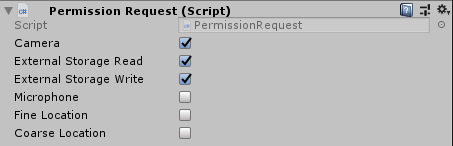
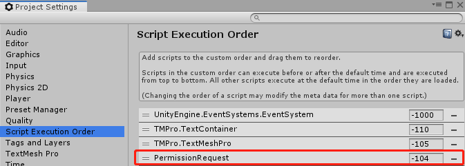

# Module_AndroidPermission

The Module_AndroidPermission Module obtains permissions dynamically. It is compatible with Android6.0 (API level 23) and above.

This article includes the following content:

•	Available permissions
•	Use of Android Permission
•	Precautions

**Available permissions** 

This Module supports the following six permissions:

- "android.permission.WRITE_EXTERNAL_STORAGE"
- "android.permission.READ_EXTERNAL_STORAGE";
- "android.permission.ACCESS_COARSE_LOCATION"
- "android.permission.ACCESS_FINE_LOCATION"
- "android.permission.RECORD_AUDIO"
- "android.permission.CAMERA"

### Use of Android Permission

This section will guide you how to use Android Permission:

* Mount the PermissionRequest component and check the checkboxes of the required permissions, as illustrated below:

> The component is located at SDK\Modules\Module_AndroidPermission\Scripts. Developers can refer to this script to extend a new permission request.

* When the project starts in the glasses end, a permissions dialog prompt will pop up. Please grant the required permissions according to the needs.

### Precautions 

To ensure that the permission application is executed before the permission is used, please place the script execution order of **Module_AndroidPermission\Scripts\Permission Request.cs** on a higher priority in **Edit>ProjectSettings>Scripts Execution Order**.

