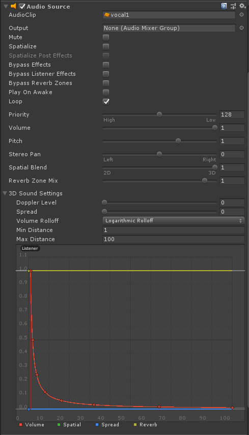
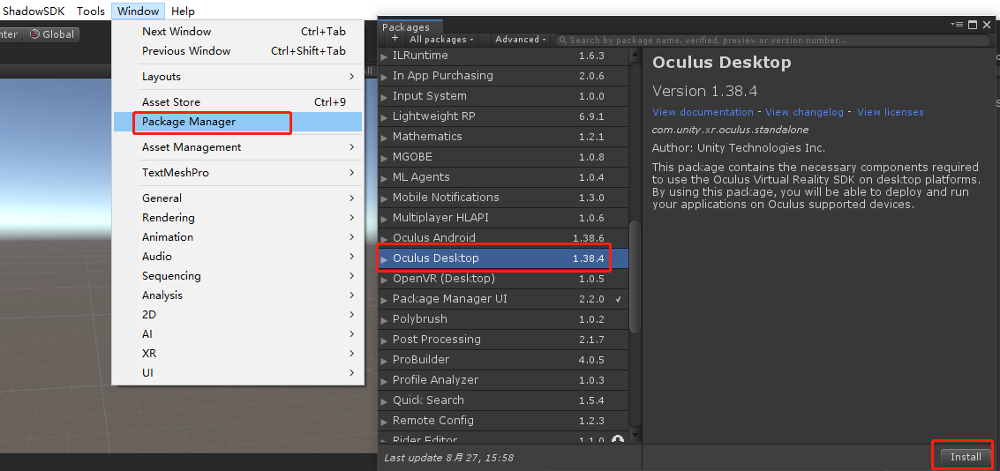
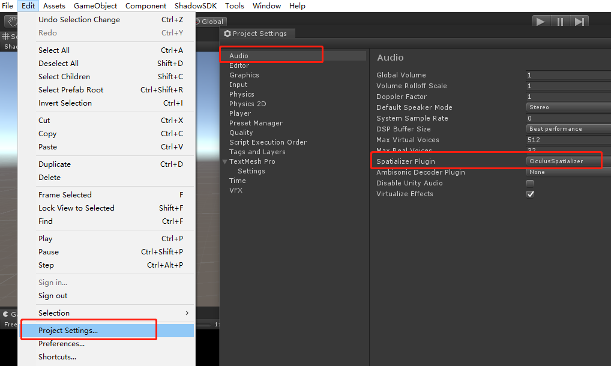
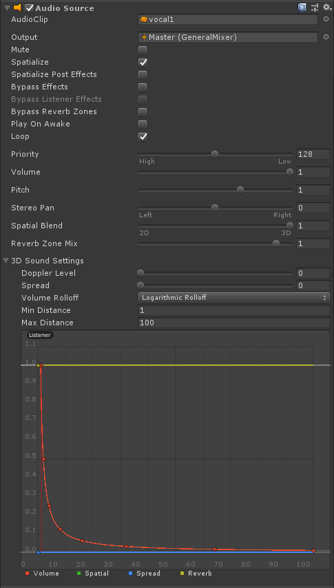
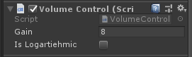

# Module_AudioSpatialize

The AudioSpatialize Module provides 3D spatial sound effects to developers.

## Using Module_AudioSpatialize

SDK supports two ways of using spatial sound effects. The first way is to use the 3D spatial audio channel that comes with the Unity’s Audio Source, and the second way is to use the built-in spatial sound effect plug-in of Unity. The latter is better in terms of experience but will cost more performance consumption. The former is weaker in terms of experience but does not incur additional performance consumption.

1.	Instructions for using spatial sound effects without using plug-ins:
•	Add the Audio Source component to the game object that needs to play audio
•	Configure the audio to play in Audio Clip of Audio Source
•	Set the value of Spatial Blend to 1
•	Set the value of Doppler Level to 0 (If you need to enable the Doppler effect, set the value to 1）
•	Set the mode of Volume Rollof to Logarithmic Rollof

2.	Instructions for use for spatial sound effect plug-ins

•	Import the Oculus Desktop spatial sound effect plug-in at the menu Window>Package Manager
•	Select the Oculus Spatialize configuration at the menu Edit>Project Settings>Audio>Spatialize Plugin
•	Add the Audio Source component to the game object that needs to play audio
•	Configure the audio to play in Audio Clip of Audio Source
•	Output this audio through an Audio Mixer, select an Audio Mixer at Output
•	Enable the Spatialize spatial sound effect
•	Set the value of Spatial Blend to 1
•	Set the value of Doppler Level to 0 (If you need to enable the Doppler effect, set the value to 1)
•	Set the mode of Volume Rollof to Logarithmic Rollof

**Note:** When the Spatialize spatial sound effect is enabled, the audio volume will be reduced. At this time, you need to add a gain volume to the audio volume. Please set this Volume to a gain of 8.0dB at Master>Attenuation>Volume of Audio Mixer.

​    SDK also provides a control script to developers for spatial sound effects of an inverse square attenuation curve, which is located at SDK>Modules>Module_AudioSpatial>Scripts>VolumeControl.cs. 
​    Just need to mount this script to the game object that needs to play audio:
•	The Gain parameter of this script is used to gain more volume when the Spatialize spatial sound effect is enabled
•	The parameter IsLogarithmic is whether to enable the logarithmic decay curve for attenuation.

**Note: ** This gain value requires the Audio Mixer to expose the property of Master>Attenuation>Volume to the script, and the parameter name is "Gain".

  