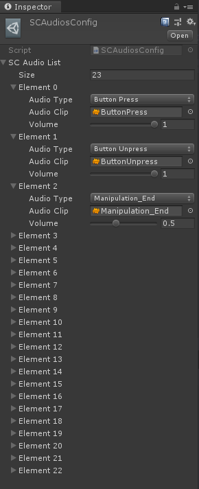

# Module_AudioSystem
The AudioSystem Module is to manage the sound effects. The interactive sound effects of all the components in SDK are managed by this Module.

## Using AudioSystem

   SDK provides the **AudioSystem** script for developers, which is located at **SDK\Modules\Module_Audio System\AudioSystem.cs**. Developers can directly call the **PlayAudioOnShot** method of this singleton:

  `public void PlayAudioOneShot(GameObject target, SCAudiosConfig.AudioType audioType, float volumeScale = 1f) `

*    The required parameters are: 

  o  **target**: the vocal object

  o  **audioType**: the sound effect type

  o  **volumeScale**: the volume scale of the sound effect

*    When developers successfully call this function method, this script will instantiate a game object named AudioSystem in the scene. This object has the AudioSystem script components.

## Customization of AudiosConfig

* If developers need to customize the trigger sound effect, they can double-click SDK\Modules\Module_ AudioSystem\Resources\Configs\ScAudioConfig, and then find the corresponding AudioType in the Inspector view, and drag and drop the customized trigger sound effect into AudioClip.

*	If developers need to extend the trigger sound effect of interactive events, they can add custom naming in the enumeration AudioType at SDK\Modules\Module_AudioSystem\ScAudioConfig.cs, and then add sound effect clips at SCAudioConfig.

