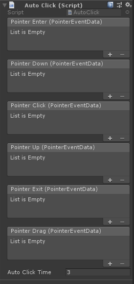

# Module_AutoClick
`AutoClick` The module is used to provide developers with the function of AutoClick

## Using Module_AutoClick

* SDK provides the `AutoClick` script to developers, which is located at SDK`SDK\Modules\Module_AutoClick\Scripts\AutoClick.cs`处。
* Mount the AutoClick script on the game object that needs to be triggered by the gaze click
* The game object needs to have a Collider component (such as BoxCollider) and have the conditions to be detected.

## Properties of AutoClick script

`AutoClickTime`：Indicates how long the cursor is on Collider to trigger a click

