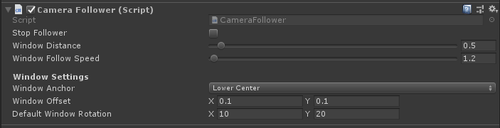

# Module_Follower
With Module_Follower, game objects can be setup to follow the movement of the camera field of view.

## Using Module_Follower

Mount the script **SDK\Modules\Module_Follower\CameraFollower.cs** on the game object that needs to follow the movement of the camera field of view.

## The CameraFollower script supports the following parameters

Follow Distance represents the distance of that the game object keeps with the Camera after following it. The default value is 2 meters.

Follow Time represents the refresh frequency, which is refreshed every 2 seconds by default. When the game object disappears in the camera field of view, it will trigger the game object to return to the center of the camera field of view after the preconfigured Follow Time.

**Extension:** Developers can refer to this script to extend the following effect of the game object and restore the relative position of the camera field of view.