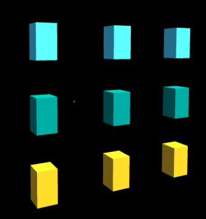
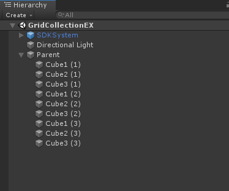

# Module_GridCollection
With Module_GridCollection, any number of 3D objects can be arranged in Editor mode.

## Using Module_GridCollection

•	SDK provides the SCGrid Layout Group script to developers, which is located at **SDK\Modules\Module_GridCollection\Scripts\SCGrid Layout Group**.
•	Create a common parent object for any number of 3D objects that need to be arranged, and then mount the SCGrid Layout Group script on this parent object.
•	After finishing the parameter adjustment, click the Refresh Info button to update the arrangement of the 3D object group.

## Parameter analysis of the SCGridLayoutGroup script

1. Is Ignore Inactive Obj: indicates whether to ignore inactive 3D objects
2.	Group Sort Type: represents the order of the 3D object group:
•	childindex: sort by the rendering order
•	childAlphabet: sort by an alphabetical order of the 3D object
•	childIndexReverse: sort by a reverse order of rendering
•	childAlphabetReverse: sort by a reverse alphabetical order of the 3D object
3.	Group Array Type: indicates in what formation the 3D object group is arranged:
•	Plane: plane arrangement
•	Cylinder: cylindrical arrangement
•	Sphere: spherical arrangement
•	Radial: radial arrangement
•	Round: circular arrangement
4.	Facing Type: represents the front facing direction of each 3D object:
•	None: no orientation
•	FaceOrigin: the front facing towards the origin
•	FaceOriginReversed: the back facing towards the origin
•	FaceParentFoward: towards the front position of the parent object
•	FaceParentBack: towards the back position of the parent object
•	FaceParentUp: towards the upper position of the parent object
•	FaceParentDown: towards the lower position of the parent object
•	FaceCenterAxis: the front facing towards the center axis
•	FaceCenterAxisReversed: the back facing towards the center axis
5.	Anchor Layout: represents the anchor position of the 3D object group relative to the parent object
6.	Layout Type: represents the layout type of the 3D object group:
•	Vertical: vertical order
•	Horizontal: horizontal order
7.	Columns: represents the number of columns
8.	Rows: represents the number of rows
9.	GroupHorizontalAlign: represents the alignment of child objects when the 3D objects are less than one row
10.	GroupVerticalAlign: represents the alignment of child objects when the 3D objects are less than one column
11.	SpaceX: represents the horizontal distance between 3D objects
12.	SpaceY: represents the vertical distance between 3D objects
13.	ChildOffsetX: represents the value of the X axis of the 3D object relative to the parent object
14.	ChildOffsetY: represents the value of the Y axis of the 3D object relative to the parent object
15.	ChildOffsetZ: represents the value of the Z axis of the 3D object relative to the parent object
16.	Radius: represents the radius
17.	RadialRange: represents the radiation angle
18.	IsAnchorWithAxis: indicates whether the anchor point is aligned with the axis
19.	Refresh Info: represents data update
