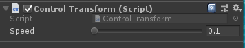

# Module_InputControl
Module_InputControl supports controlling **forward/backward/left/right** movement and angle rotation while debugging on PC, to simulate the movement of a  XR device.

## Using InputControl

* **SDK\Modules\Module_InputControl\Scripts\ControlTransform.cs** can be used to modify other control buttons.
* Mount the script on the game object that needs to be controlled.

## The ControlTransform script supports the following parameters.
•	The parameter Speed represents the speed of moving the game object forward, backward, to the left, to the right, and rotating the object. The default value is 0.1 m/s.

•	Press **W** to move the object forward

•	Press **S** to move the object backward

•	Press **A** to move the object to the left

•	Press **D** to move the object to the right

•	Long press the right mouse button and slide horizontally to rotate the object left and right

•	Long press the right mouse button and slide back and forth to rotate the object up and down

**Note:** This Module script has been mounted on the game object by default at **System/SvrCamera/Head**

