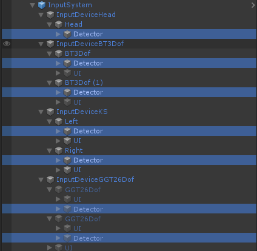
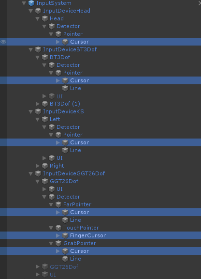

# Module_InputSystem

If you want to understand the content of the input system in the SDK about the headset, Bluetooth controller, hand tracking, etc., this article will help you, and the specific description is divided into the following chapters：

* Overview
* Terminology
* Use

## Overview

**Module_InputSystem**  is a component of SDK. It is the largest Module used to manage all the data collection, data processing, target detection, event distribution, etc. of the system. It contains many details. The full picture of Module_InputSystem is shown in the figure below：

## Terminology

Module_InputSystem is composed of many parts, and each part performs its own duties. Some important parts are presented and explained as follows：

- **InputDevices**

    Module_InputSystem manages all the inputs of the system. According to the different system inputs, define InputDevice, that is,  each InputDevice represents a certain type of input

    The currently supported InputDevices are as follows：

    

    * InputDeviceHead - Manage Headset (HMD) input devices
    * InputDeviceBT3Dof - Manage Bluetooth 3Dof Controller input devices
    * InputDeviceKS - Manage K series Game Controller input devices
    * InputDeviceGGT26Dof - Manage Hand Tracking input devices
    
    
    
- **InputDeviceParts**

    For a specific InputDevice, it may consist of multiple parts, such as a 3Dof GameController, which consists of a left GameController and a right GameController. For this reason, the concept of InputDevicePart is proposed. InputDevicePart represents a specific part of the input device. The InputDevicePart supported by each input device is as follows:

    

    * Head - The only component of InputDeviceHead
    * BT3Dof - Left/right controller of InputDeviceBT3Dof
    * GGT26Dof - Left/right hand tracking of InputDeviceGGT26Dof

- **Detector**

    For a certain InputDevicePart, it needs to detect game objects in the 3D world and send events to the game objects. This part is completed by Detector：
    
    As shown below：
    
    

    Detector is mainly composed of multiple Pointers, and each Pointer is responsible for detection tasks with different requirements
    
- **Pointer**

    Detector is responsible for detecting game objects in the 3D world. According to different detection requirements, it is divided into multiple Pointers to detect. Each Pointer is responsible for a certain type of detection, as shown in the figure below：

    

    * FarPointer - Responsible for remote interaction, such as headsets and Bluetooth 3Dof controllers use this type of Pointer
    * TouchPointer - Responsible for hand near touch interaction, mainly used for hand tracking touch game objects
    * GrabPointer - Responsible for hand near grab interaction, mainly used for hand tracking near grab game objects

- **Cursor**

    Cursor is the cursor of Pointer, mainly used to display the current focus position and status
    
    

- **Line**

    Line is the ray of Pointer, mainly used to display the direction and distance of detection
    

* **Data**

    For an InputDevicePart, Data is used to represent all the data types of this InputDevicePart, and the data input by the input device will be stored here
    
* **DataGet**

    For an InputDevicePart, a specific data acquisition class needs to be provided, and DataGet is used for this purpose
* **Status**

    For a certain InputDevicePart, open or close the judgment class, used to determine whether this InputDevicePart is open or closed
* **UI**

    For a certain InputDevicePart, the class responsible for UI display, mainly used for the visual display function of InputDevicePart

## Use

The use of Module_InputSystem is mainly divided into the following two steps：

1. Add Module_InputSystem to the scene

2. Enable or disable InputDevice

### Add Module_InputSystem to the scene
The use of **Module_InputSystem** is very simple, because it has been bound to the SDKSystem Prefab, so you can instantiate this Prefab directly in the Inspector view：

Click the menu item SDK->SDKSystem to add the SDKSystem game object in the inspector view, as shown below：

The game object **SDKSystem** contains the following：

The InputSystem game object means Module_InputSystem

### Enable or disable InputDevice

Some InputDevices can be dynamically opened or closed, as shown below：

* **ActiveHead=1** - Turn on the head-mounted display mode

* **ActiveGGT26Dof=1** - Turn on the hand tracking mode

    > The InputDeviceGGT26Dof input device will automatically close the InputDeviceHead input device when the input device is turned on

* **ActiveBT3Dof=1** - Turn on the InputDeviceBT3Dof input device

    > The InputDeviceBT3Dof input device is turned on and the InputDeviceHead input device will be automatically closed

* **ActiveKS=1** - Turn on the InputDeviceKS input device

    > The InputDeviceKS input device is turned on and the InputDeviceHead input device will be automatically closed

* **KSMode6Dof=1**- Turn on the 6Dof mode of InputDeviceKS input device

> Note: The attribute value sets the default state of the SDK. The configuration file will be generated during Runtime at /sdcard/Android/data/packagename/files/SDK_Configs.txt，Overwriting the value can modify the SDK configuration without recompiling the APP

