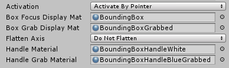
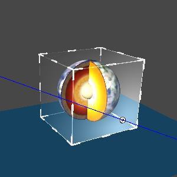
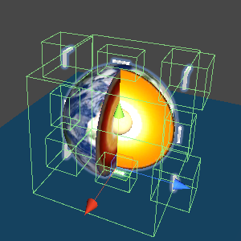
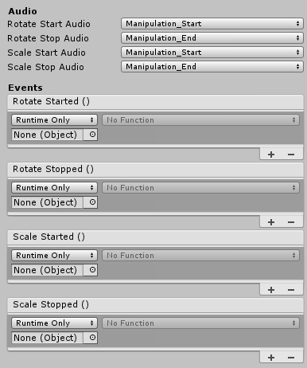

# BoundingBox

`BoundingBox` is a component that can edit virtual objects dynamically through a head-mounted display, Bluetooth controller, and Hand tracking. It can modify the Position, Rotate, Scale and other properties of virtual objects.

## How to use BoundingBox

The `BoundingBox` script and the `BoxCollider` script must be mounted to the game object that needs zoom and rotation functions

* Activation

When `Active On Start` is selected, the interactive borders will always be displayed around the game object after it is started.
When `Active By Pointer` is selected, the interactive borders will only be displayed when the cursor moves up.

* Box Focus Display Mat

When moving the cursor onto the game object, you will see the material of the interactive border Cube.

* Box Grab Display Mat

When clicking or grabbing the game object, you will see the material of the interactive border Cube.

* Flatten Axis 

It can be defined that only the vertical plane towards a certain axis can be interacted. Other planes cannot be interacted. The above picture shows the result of selecting `Flatten X`, which is mostly used for 2D planes.
`Do not Flatten` - means not using flat interactions

`Flatten X/Y/Z` - means that only the vertical plane towards the selected axis can be interacted

`Flatten Auto` - the thinnest plane will be selected as the interactive plane automatically. Usually `Flatten Z` is auto-selected.

* Handle Material

The material of the borders when not clicked

* Handle Grab Material

The material of the borders when clicked

* Show Scale Handles

When the checkbox of `Show Scale Handles` is checked, the Scale function is enabled and the borders of 8 corners are visible, and vice versa. When the `checkbox` is not checked, the Scale function will not enabled and the borders will not visible.
*  Corner Prefab

It refers to the Prefab Model of the corner border.

* Corner Slate Prefab

It refers to the Prefab Model of the corner border when `Do not Flatten` is not selected for `Flatten Axis`:

*  Scale Minimum and Scale Maximum indicate the upper and lower limits of zoom.
*  Scale Handle Size indicates the size of the corner border Model.

* Mid Point Prefab

It refers the Prefab Model of the side border.
* Rotation Handle Size

It refers to the size of the side border Model.
*  Show Rotation Handle For X/Y/Z

It indicates whether to display the borders in the X/Y/Z direction, respectively.

*  Rotate Start/Stop Audio

It refers to the sound effects at the beginning and at the end of the rotation.
*  Scale Start/Stop Audio

It refers to the sound effects at the beginning and at the end of zoom
*  Rotate Started/Stopped

It is used to register and unregister the events of the rotation start and end.
*  Scale Started/Stopped

It is used to register and unregister the events of the zoom start and end.
