# Button
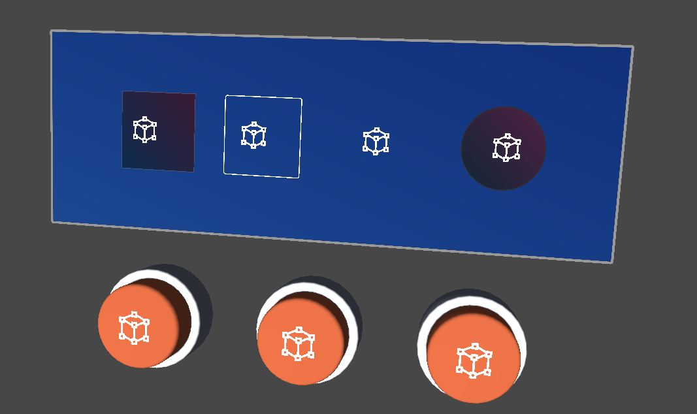

In addition to the UGUI Button, SDK also provides some Collider-based Buttons used for the click effects triggered by hand touch.

## Button Prefab
The button Prefab is located at `SDK\Modules\Module_Interaction\Button\Resources\Prefabs`.

### Button based on Image/Graphic (UGUI)
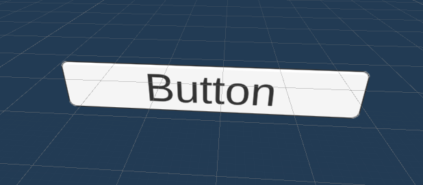

Add the` NearInteractionTouchableUnityUI` component based on the UGUI Button to achieve the click effects triggered by hand touch.

### Button based on Collider
| 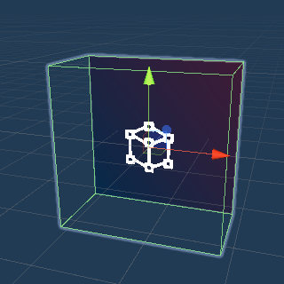 | 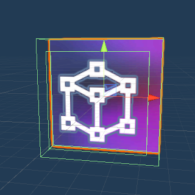 | 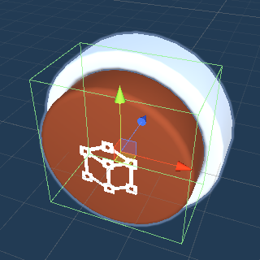 |
| ------------------------------------------------------------ | ------------------------------------------------------------ | ------------------------------------------------------------ |
| SCButton                                                     | SCImageButton3D                                              | SCRoundButton                                                |
| Basic Button, which provides event triggering and special lighting effects when it is clicked and touched | Button based on SCImage3D, which is used in a similar way as Image. It is possible to freely modify the texture colour and size | 3D Model Button. It is possible to modify the corresponding Model and effects according to needs |

Since Collider does not provide button click events and the triggering of hand touch events, developers need to implement these functions themselves. SDK provides a `PressableButton`, which is used to trigger the click events and animation effects of the head-controlled rays, handle rays, and remote hand tracking rays. SDK also provides a `TouchableButton`, which is used to trigger the click events and animation effects of near-touch hand.

## How to use PressableButton
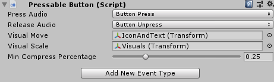

`PressableButton` provides the events such as the button being pressed, released, clicked, entered, and exited when using rays (including head-controlled rays, controller rays, and hand tracking rays). It also provides animation and sound effects when the button is clicked and released.

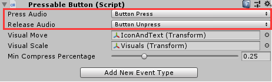

The properties of `Press Audio` and `Release Audio` represent the sound effects of the button being pressed and released, respectively.

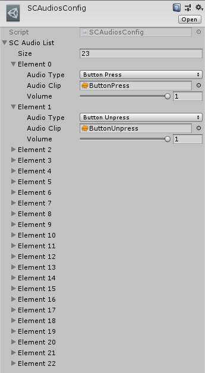

If you need to customize the sound effects, you may modify the `SCAudiosConfig.asset` resource file located at `SDK\Modules\Module_AudioSystem\Resources\Configs`, and add the corresponding `AudioClip` and create a custom enumeration.

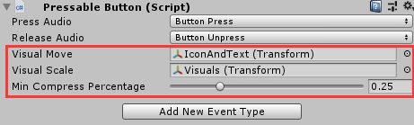

The z-coordinate of the game object assigned to the `Visual Move` property will change when the button is pressed or released. Similarly, the z-scale of the game object assigned to the `Visual Scale` property will change when the button is released.` Min Compress Percentage` represents the magnitude of the press. For example, if the current value is 0.25, the z-coordinate will move/zoom to 25% of the current value.

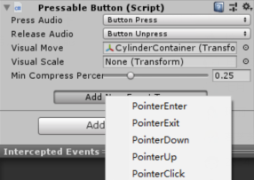

The way of using the `Add New Event Type` button is similar to the `Event Trigger` component in UGUI. You just need to select the corresponding event name and add the corresponding event triggering method.

## How to use TouchableButton
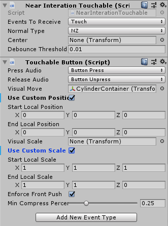

`TouchableButton` provides the events such as the button being pressed, released, continuously pressed, entered, and exited when using near-touch hand. Also, it provides animation and sound effects when the button is clicked and released.
`TouchableButton` can be used by mounting the` NearInteractionTouchable` script (3D object) or the `NearInteractionTouchableUnityUI` script (UGUI) to the game object. These two scripts are used to enable the game object to be detected by nearby hand. When `Touch` is selected as the type of Event Type Receive, the triggered events are `PokeUp`, `PokeDown`, and `PokeUpdate`. When `Pointer` is selected as the type of `Event Type Receive`, the triggered events are` PointerUp`, `PointerDown`, `PointerEnter`, `PointerExit`, and `PointerClick`.
In general, `Touch` will be selected for `Event Type Receive` based on Collider Buttons while `Pointer` will be selected for `Event Type Receive` based on UGUI Buttons, so that the UGUI custom events can be triggered.
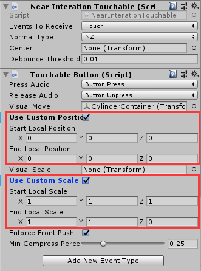

In addition to providing the same properties as `PressableButton`, `TouchableButton` also provides the checkboxes of `Use Custom Position` and `Use Custom Scale` to select. When `Use Custom Position` is selected, you can manually configure the start position and end position of the assigned game object in `Visual Move`. When `Use Custom Scale` is selected, you can manually configure the start scale and end scale of the assigned game object in `Visual Scale`.

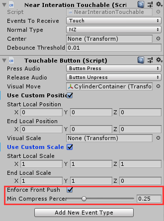

User can click the hit objects of the `Box Collider` not only through the front, but also through the side. In most cases, clicking from the side to trigger the button event is not a desirable result expected by developers. The constraint button of `Enforce Front Push` will trigger the button click event only when clicking the front of the `Box Collider`.
Since the `PokeUpdate` event is triggered only in the Touch mode, triggering the button click event needs to be determined by `Min Compress Percentage`. For example, if the current value is 0.25, it means that "`Poke Press`" will be triggered when the button is pressed to 25%, and "`Poke Release`" will be triggered when the button bounces back to 75%.
## How to customize Button
•	If you just want to implement ray-related click operations, such as head-controlled ray, GameController ray, and hand tracking ray,  you can use the Unity’s own event interfaces, such as `IPointerEnterHandler, IPointerDownHandler, IPointerClickHandler, IPointerUpHandler, IPointerExitHandler`, etc.

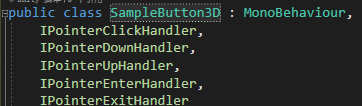

•	If it is a 3D game object, you need to add the Collider component and the script that implements the corresponding event interfaces.

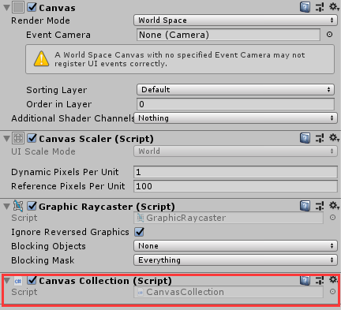

•	If it is a UGUI game object, you need to add the `CanvasCollection` components to the Canvas game object and then you can just use the UGUI native components (e.g. the Button component).

---

If near-touch related operations need to be implemented (e.g. clicking a button with an index finger).

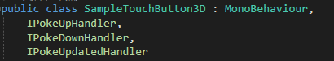

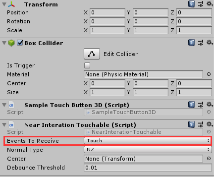

for 3D game objects, you need to add the Collider component (preferably `BoxCollider`) and the `NearInterationTouchable` component first, and then implement the additional event interfaces `IPokeUp`, `IPokeDown` and `IPokeUpdate` provided by SDK.

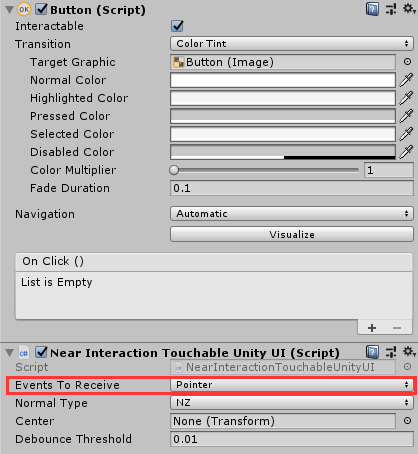

For UGUI game objects, in addition to adding `CanvasCollection` to the Canvas component, the `NearInteractionTouchableUnityUI` script also needs to be added to the UI related game objects and the type of `Event Type Receive` needs to be modified to Touch.