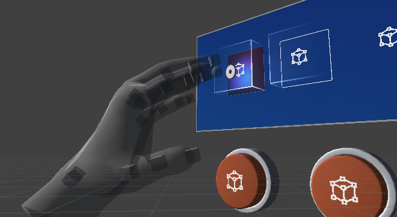
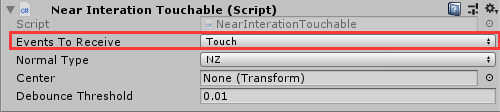
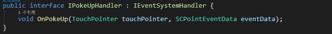
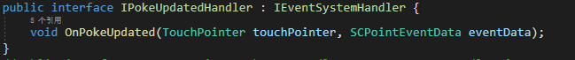
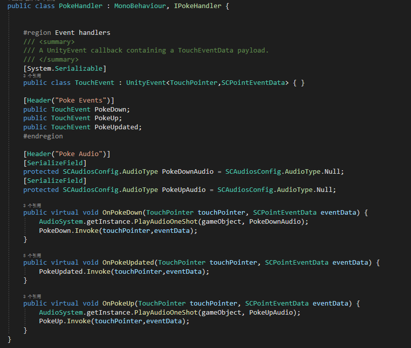

# HandTouch

Near-touch hand tracking interactions are different from ray-related interactions (such as mouse, touch screen, head controlled ray, handle ray, distant hand tracking ray, etc.). Determining hand tracking can be performed in two steps. The first step is to determine whether the object is in the range of a sphere, with the index finger of the hand model as the center, contains the `BoxCollider` and `NearInteractionTouchable` components, or whether the object only contains the `NearInteractionTouchableUnityUI` components. The second step is to trigger the corresponding events according to the distance between the eligible game object and the tip of the index finger.

## How to use HandTouch

For a 3D object, the` BoxCollider` script and the `NearInteractionTouchable` script need to be mounted, so that the game object will receive the near-touch hand tracking events. When Touch is selected as the type of` Events To Receive`, the received events are `PokeDown`, `PokeUp`, and `PokeUpdate`. When` Pointer` is selected as the type `Events To Receive`, the received events are `PointerDown, PointerUp`, and` PointerClick`, which are the events coming with the Unity's own event system.

For UGUI objects, the `NearInteractionTouchableUnityUI` script needs to be mounted. Since UGUI usually has its own event interaction related scripts (such as Button, etc.), normally `Pointer` is selected as the type of `Events To Receive`, in order to adapt to UGUI faster.

## hand tracking-based specific event types

PokeDown, PokeUp, PokeUpdate are the additional event types added by SDK for near-touch hand tracking 

OnPokeDown is triggered when the tip of the index finger enters the hit object. 

OnPokeUp is triggered when the tip of the index finger leaves the hit object.

After OnPokeDown is triggered, OnPokeUpdate will be triggered on every frame. When OnPokeUp is triggered, OnPokeUpdate will stop triggering.

SDK provides the `PokeHandler` script, which is located at the following path: `SDK\Modules\Module_Interaction\HandTouch\Scripts`. 
Developers can imitate or inherit the script to rewrite the virtual methods.
