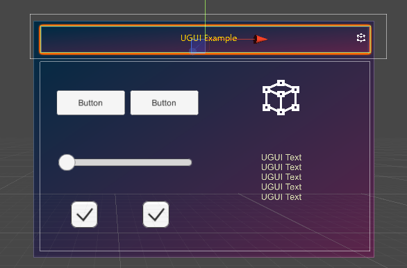
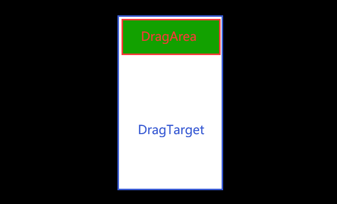

# ManipulationHandler

## How to use ManipulationHandler

You need to at least mount the `BoxCollider` component, or the components inherited from `Graphic` in UGUI (such as `Image, RawImage, Text`, etc.) to the game object or or its child game objects with `ManipulationHandler` included. At the same time, you also need to mount the `NearInterationGrabbable` component, which is used for drag-and-drop operations by near-touch hand.
>To mount UGUI-related components, you need to mount the`CanvasCollection` component on the game object in which Canvas is located.

Sometimes you want to drag a child game object and then control the position of its parent game object.

In this case, you may mount this object to `Target`, to achieve that when dragging the child game object, its parent game object is also dragged.