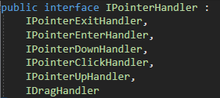
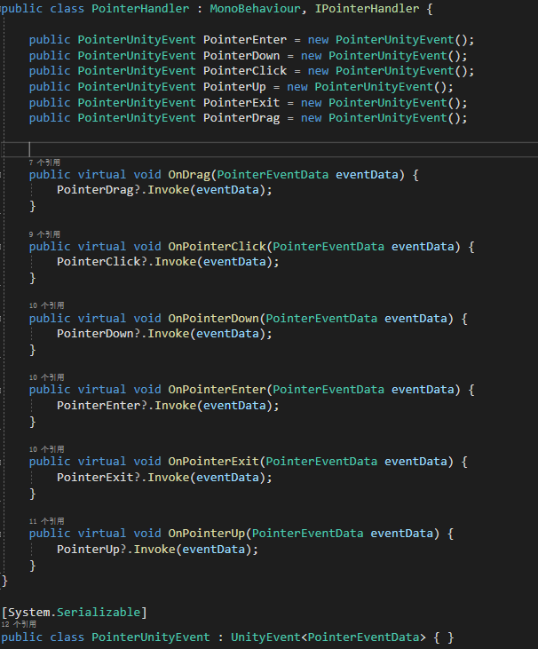

# PointerHandler

SDK provides an Interface that integrates some common events in `Unity`, including `IPointerExitHandler, IPointerEnterHandler, IPointerDownHandler, IPointerClickHandler, IPointerUpHandler, IDragHandler`.

## How to use PointerHandler

You may find some `PointerHandler` scripts provided by SDK via the following path:
`SDK\Modules\Module_Interaction\PointerHandler\Scripts`. 
You can directly use them or rewrite some of the virtual methods in the scripts.

>If you want to trigger the events in `PointerHandler` by near-touch hand, please mount the `BoxCollider` component and the `NearInteractionTouchable` component to the 3D game object and set the type of `Events To Receive` to `Pointer`. If it is a UGUI object, please mount the `NearInteractionTouchableUnityUI` component to the game object and set the type of `Events To Receive` to `Pointer`. 