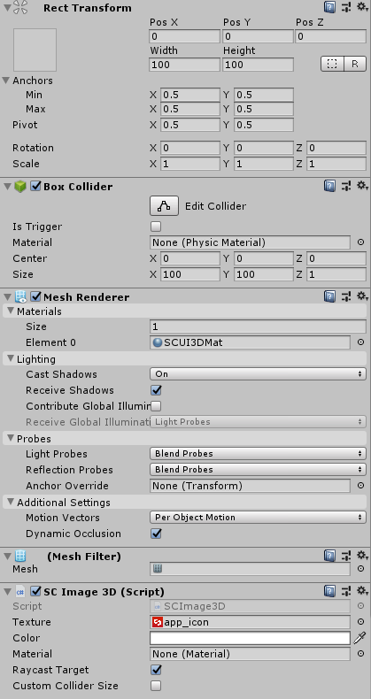

# SCImage3D

XR applications often require the entire UI to be draggable. However, `UGUI` has some limitations including:
-	`ZTest` is determined by the order in`Hierarchy`, and 
-	Ray detection uses `GraphicRaycast`, which must be rendered under the `Canvas` component, etc.
These kinds of limitations lead to `UGUI` not suitable for making the entire UI draggable. Some potential issues are as follows:
-	Buttons might not trigger the click event
-	Rendering effects might not perform as well as expected, etc. 
Therefore, SDK has provided the `SCImage3D` components that are based on `MeshRenderer` and `BoxCollider` to circumvent the limitations of `UGUI Image`.

## Prefab of SCImage3D
Prefab is located at `SDK\Modules\Module_Interaction\SCImage3D\Resources\SCImage3D.prefab`.
It can also be created by right clicking `SC3DUI/SCImage3D` in the Hierarchy panel.
## How to use SCImage3D

`SCImage3D`can be placed in the scene directly without `Canvas` and it uses `MeshRenderer` and `BoxCollider`. The way of using `SCImage3D` is very similar to `UGUI Image`.

You may control the size of the picture by configuring `RectTransform`.

The property of `Texture` is used to configure the displayed image, the property of `Color` is used to configure the displayed color, and the property of `Material` is used to customize the material.
>In the `Shader` of the custom material, the name of the sampler must be` _MainTex` and the name of the colour attribute must be `_Color`. Otherwise the attribute settings of `Texture` and `Colour` might be invalid after using the custom material.

The `Raycast Target` is used to control the attribute of `enable of BoxCollider`.

If the `Custom Collider Size` is not checked, the properties of `Center` and `Size of BoxCollider` will adapt to the size of the picture automatically. If this option is checked, you can manually configure the properties of `Center` and `Size of BoxCollider`. 

>If it is unchecked, only the x-axis and y-axis will adapt to the size of the picture automatically. You can still set the z-axis manually.