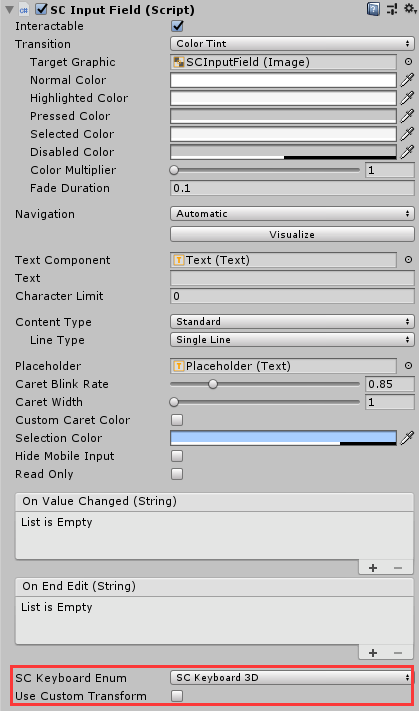
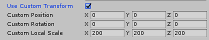

# SCInputField

SCInputField is used to let the user input enter any kind of text.

## Prefab of SCInputField
The SCInputField Prefab is located at `SDK\Modules\Module_Interaction\SCInputField\Resources\SCInputField.prefab`. 
It can also be created by right clicking `SC3DUI/SCImage3D` in the`Hierarchy` panel.
The keyboard Prefab is located at 
`SDK\Modules\Module_Interaction\SCInputField\Resources\Keyboard`.

## How to use SCInputField

Except for `SC Keyboard Enum` and `Use Custom Transform`, all fields of `SCInputField` and `InputField` in `UGUI` are the same. The `SC Keyboard Enum` currently only supports the `SC Keyboard 3D` option.

When the `Use Custom Transform` is not checked, the keyboard pops up at a lower position of the head facing after clicking `SCInputField`.
When the `Use Custom Transform` is checked, you can customize the properties of `Transform` of the keyboard popping up.

No matter whether the `Use Custom Transform` is checked or unchecked, the keyboard will always adjust the popping-up position to a lower position of the head facing according to the directions of head movements.

## How to customize Keyboard
Refer to the SCKeyboard3D script, which is located at `SDK\Modules\Module_Interaction\SCInputField\Resources\Keyboard\Scripts\SCKeyboard3D.cs`. 
Inherit the custom keyboard class from the` SCKeyboardBase` script, which is located at `SDK\Modules\Module_Interaction\SCInputField\Resources\Keyboard\Scripts\SCKeyboardBase.cs`.

Create a new enumeration for `SCKeyboardEnum` and add the enumeration name and the created keyboard type to the `keyboardTyeDic` dictionary.
