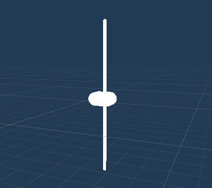
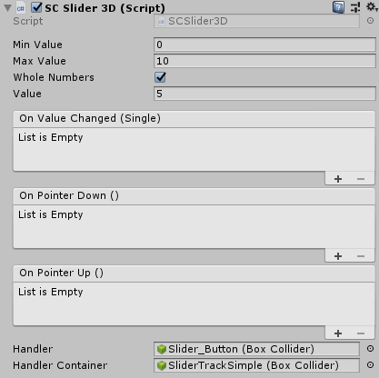

# SCSlider3D

`SCSlider3D` is a Slider based on `Collider`, which is used in scenes that requires 3D-Slider effects.

## Prefab of SCSlider3D
* The `SCSlider3DType1`  Prefab is located at `SDK\Modules\Module_Interaction\SCSlider3D\Resources\Prefabs\SCSlider3DType1.prefab`. It can also be created by right-clicking `SC3DUI/SCSlider3DType1` in the `Hierarchy` panel.

* The `SCSlider3DType2` Prefab is located at `SDK\Modules\Module_Interaction\SCSlider3 \Resources\Prefabs  SCSlider3DType2.prefab`. It can also be created by right-clicking `SC3DUI/SCSlider3DType2` in the `Hierarchy` panel.

Besides some difference in the model between `SCSlider3DType1` and `SCSlider3DType2`, the value of `SCSlider3DType1` is an Integer data type and the value of `SCSlider3DType2` is a decimal data type.

## How to use SCSlider

The `Min Value` represents the minimum value of the Slider and the `Max Value` represents the maximum value of the Slider. 
When `Whole Numbers` is checked, the output of the Slider can only be integers either via moving the Slider pointer or directly inputting value. When `Whole Numbers` is unchecked, the output of the Slider can be any value between the `Min Value` and the `Max Value`, including integers and decimals.
The `On Value Change` event is triggered when the value changes, the `On Pointer Down` event is triggered when the Slider pointer is clicked and pressed, and the `On Pointer Up` event is triggered when the Slider pointer is released.
`Handler` represents the Slider pointer and it can only be moved along the defined range of the X- axis, based on the `Size` property of the `BoxCollider` component in the `Handler` Container.
>Currently the system ONLY supports the movement along  the X-axis direction, which is based the `Size` property of `BoxCollider` as mentioned.
