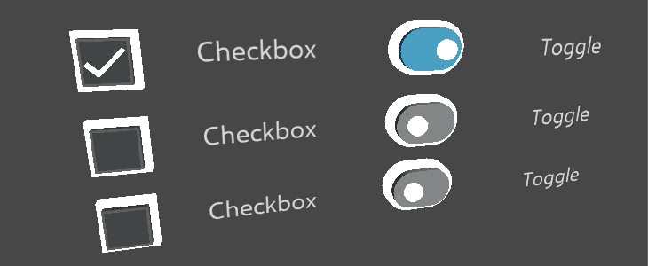
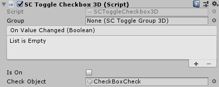
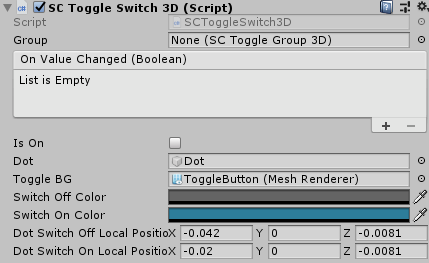
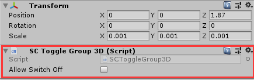
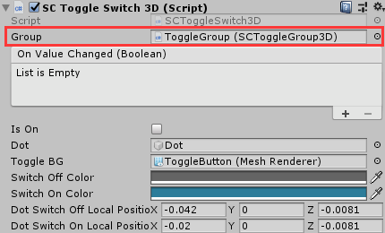

# SCToggle3D

`SCToggle3D` is a 3D switch based on `Collider`. SDK provides two types of switches. One is `Toggle` and the other is `Switch`.

## Prefab of SCToggle3D
* The Prefab of `SCToggleCheckbox3D` is located at `SDK\Modules\Module_Interaction\SCToggle3D\Resources\Prefabs\SCToggleCheckbox3D.prefab`. It is possible to check and uncheck the checkboxes controlled by the ray clicks.
* The Prefab of `SCToggleSwitch3D` is located at `SDK\Modules\Module_Interaction\SCToggle3D\Resources\Prefabs\SCToggleSwitch3D.prefab`. It is possible to toggle the buttons controlled by the ray clicks.

## How to use SCToggle3D

In the `SCToggleCheckbox3D` component, the` On Value Changed` event is triggered when a Checkbox is clicked either to check or uncheck.  `Is On` indicates whether it is turned on or not, which can be configured via either the setting or coding. The `Check Object` will be visible or hidden based on the value of `Is On`.  

In the `SCToggleSwitch3D` component, `Dot` represents the dot of the switch. It will move to the position of the `Dot Switch On Local Position` when switching on and it will move to the position of the `Dot Switch Off Local Position` when switching off.
`Toggle BG` represents the background `MeshRenderer` object of the switch. The `Switch On Color` applies when switching on and the `Switch Off Color` applies when switching off.
>To use custom material, the `_Color` property needs to be contained in the Shader of the material.

## Group Toggle
Sometimes it is preferred that only a single Toggle button can be selected at once in a group of Toggle buttons. To do so, it is recommended to assign these Toggle buttons to the same parent game object and mount the `SCToggleGroup3D` component on the game object.	

To add the Toggle buttons at the same group, you can just mount the same `SCToggleGroup3D` on the `Group` property, as illustrated above.