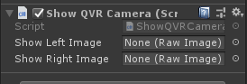

# Module_QVRCamera
Module_QVRCamera provides developers with the function of obtaining data from the fisheye camera of the XR device.

## Using Module_QVRCamera

* SDK provides the `Module_QVRCamera` script to developers, which is located at `SDK\Modules\Module_QVRCamera\Scripts\Module_QVRCamera.cs`处。
* After mounting the CameraFollower script component on any game object, assign the data returned by the fisheye camera  to the RawImage component.

## Properties of Module_QVRCamera script

`Show Left Image`：Image showing left-eye camera data
`Show Left Image`：Image showing right-eye camera data

##  Get Grayscale camera data of equipment need to pay attention to a few

This component in the access equipment grayscale camera data must pay attention to:

- Application to ensure open access switch camera.

- In the device's svrapi_config. TXT config file begins to add ` gUseQVRCamera = true ` properties.

- > **svrapi_config.txt** configuration file path for in the equipment's **/persist/qvr/svrapi_config.txt**And**/vendor/etc/qvr/svrapi_config.txt**. Equipment preferred reading/persist/QVR/configuration file path.