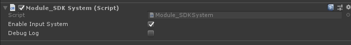
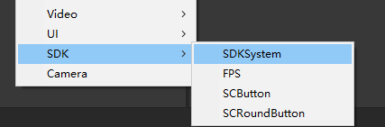

# Module_SDKSystem
The Module_SDKSystem Module is used to manage the SVR Module and the InputSystem Module. The most direct way of using SDK is to add this Module to the scene, as shown below:

## Using Module_SDKSystem

There are three ways to create Modules using SDK. You may choose any of them:

•	Developers can directly generate a SDKSystem game object in the scene by right-clicking and selecting SDKSystem in the Hierarchy view, as shown below:

•	Developers can also generate a SDKSystem game object in the scene by selecting **SDK > SDKSystem** using the Unity shortcut toolbar, as shown below:

•	The third way is to simply drag and drop the Prefab into the scene. You may find the Prefab of SDKSystem in this path: **SDK\Modules\Module_SDKSystem\Resources\Prefabs\SDKSystem.prefab**

**Note:** This Module can only be used on the  XR devices.

   
