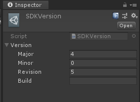

# Module_SDKVersion
Module_SDKVersion is to provide developers with the function of querying the version number of the current SDK

## Property description

`Major`：Indicates the current Major version number of the SDK
`Minor`：Indicates the current Minor version number of the SDK
`Revision`：Indicates the current Revision version number of the SDK
`Build`：Indicates the current Build version number of the SDK

